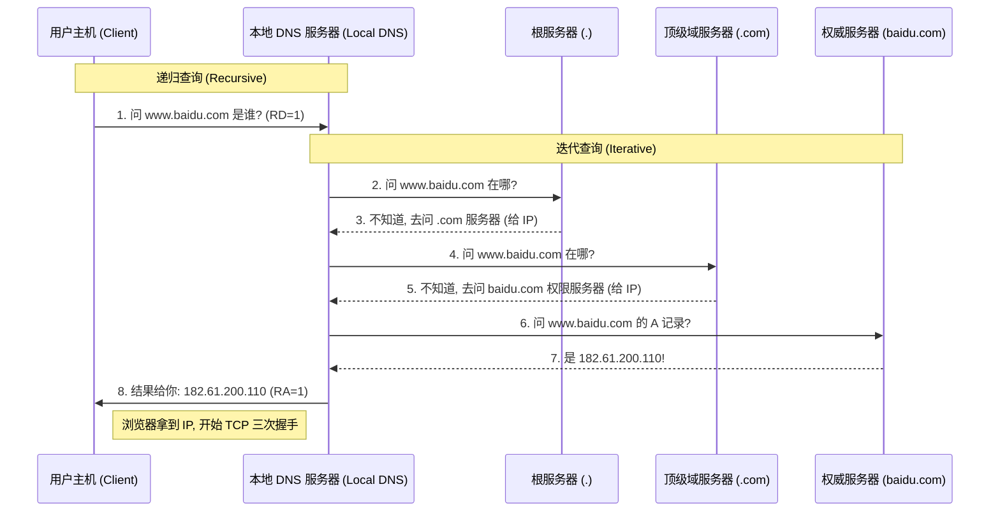

---
title: DNS域名系统
description: DNS域名系统的解析原理与工作流程
published: 2026-06-27
category: 计算机网络
tags:
    - 计算机网络
---

- 在网络世界中，计算机之间通信依靠的是 **IP 地址**（如 `192.0.2.1` 或 `240e:...`），但人类更习惯记忆**域名**（如 `google.com` 或 `baidu.com`）。
- DNS 的核心任务就是**将人类可读的域名“翻译”成机器可读的 IP 地址。**
- DNS 提供了一层**映射关系**，让域名保持不变，而背后的 IP 可以灵活更换。（域名-> IP地址）

# 特点
- 分层、基于域的命名机制
	- DNS 不是扁平的（像早期的 `hosts` 文件），而是树状结构的。从根（`.`）到顶级域（`.com`、`.cn`），再到二级域（`baidu.com`）。这种结构保证了命名的唯一性，且方便管理。
- **分布式数据库**：
	- 全球没有任何一台服务器存有所有域名记录。数据分布在数百万台服务器上。这种设计解决了**单点故障**问题，并实现了**流量扩容**。
- **运行在 UDP 之上，端口 53**：
	- 为了追求极致的响应速度，DNS 默认使用不可靠但开销极小的 UDP。因为解析请求通常很小，丢包了重发一次的代价远比维持 TCP 连接要低。
- **在网络边缘处理复杂性**：
	- 这是 Internet 设计的关键原则——**端到端原则 (End-to-End Principle)**。核心网络只负责转发数据包，而像域名解析这种复杂的逻辑放在网络边缘（用户的递归服务器）来处理。

# 目的

## 主机别名 (Host Aliasing)

- **概念**：一个主机可以有一个**规范名字 (Canonical Name, CNAME)**，同时拥有多个简单的别名。

## 邮件服务器别名 (Mail Server Aliasing)

- **概念**：这是专门为邮件系统设计的。它允许一个域名的邮件服务器名字与该域名的 Web 服务器名字不同。
- **例子**：PPT 举例了 `ustc.edu.cn`。当你发邮件给 `qzheng@ustc.edu.cn` 时，DNS 会查询 **MX 记录**，找到背后真正的邮件交换服务器（可能是 `mail.ustc.edu.cn`），即使它们的 IP 可能不同。

## 负载均衡 (Load Distribution)

- **概念**：一个域名可以对应多个 IP 地址。
- **实现**：当多个 IP 对应同一个名字时，DNS 服务器会在每次响应时轮换这些 IP 的顺序（Round Robin）。
- **效果**：**流量被均匀分配到不同的物理服务器上**。

# 组成
在 DNS 体系中，主要有四种角色：
- **DNS 解析器 (Resolver)：** 通常是你电脑里的操作系统或路由器（如 `10.255.255.254`）。
- **根服务器 (Root Server)：** 知道所有顶级域名（.com, .cn）在哪。全球共有 13 组逻辑地址。
- **TLD 服务器 (Top-Level Domain Server)：** 负责特定的后缀（如 .com 仓库）。
- **权限服务器 (Authoritative Server)：** 最终 Boss。它手里拿着真实的 IP 记录（如百度的 `a.shifen.com`）。

# 命名空间

**DNS 名字空间（DNS Namespace）** 是指互联网中所有域名构成的逻辑结构。为了解决全球数亿个设备命名的唯一性和管理问题，DNS 并没有采用平铺的结构，而是采用了一种**层级树状结构**。

### 树状层次结构

DNS 名字空间是一个倒置的树。树中的每个节点都有一个标签（Label），除了根节点。

- **根域（Root Domain）：**
    - 处于树的最顶端，用一个**点 `.`** 表示。
    - 在实际输入网址时我们通常省略它（如 `google.com` 实际上是 `google.com.`）。
- **顶级域（Top-Level Domains, TLD）：**
    - 根下面的第一级。分为：
        - **通用顶级域 (gTLD)：** 如 `.com` (商业)、`.org` (组织)、`.edu` (教育)。
        - **国家代码顶级域 (ccTLD)：** 如 `.cn` (中国)、`.jp` (日本)、`.uk` (英国)。
- **二级域（Second-Level Domains）：**
    - 你在域名注册商那里购买的具体名字，如 `baidu.com`、`ustc.edu.cn` 中的 `baidu` 或 `ustc`。
- **子域（Subdomains）：**
    - 由域名所有者自行定义的更深层次结构，如 `mail.ustc.edu.cn` 里的 `mail`。

# 区域
- 如果说“域”是 DNS 树状空间里的一个完整子树，那么“区域”就是这个子树中由特定名字服务器实际管理的一个“连通部分”。
- **域 (Domain)**：是一个逻辑实体。比如 `ustc.edu.cn` 这个域，包含了所有以这个结尾的子域名（如 `mail.ustc.edu.cn`, `lib.ustc.edu.cn` 等）。
- **区域 (Zone)**：是物理上的管理单位。它是域名空间中**连续**的一块，由某个特定的机构通过资源记录文件（Zone File）进行维护。
- 将DNS名字空间划分为一个个**区域(zone)** 
- 区域相互不重叠，是树的一部分 
- 区域划分由管理者自己决定 
- 每个区域设置一台名字服务器， 将全球繁重DNS解析任务分布化 
- 负责它所管辖区域的名字解析 
- 该名字服务器为该区域的**权威名字服务器** 
- 名字服务器可以放置在区域之外， 以保障可靠性

# 名字服务器

**名字服务器（Name Server）** 是 DNS 体系中的“核心大脑”，它是运行着 DNS 服务软件、存储着域名数据库并负责响应查询请求的**物理或虚拟服务器**。

## 名字服务器的四种角色

正如你在 PPT 中看到的“分层、分布式”设计，名字服务器按照职责分为四个级别：

### 根名字服务器 (Root Name Server)

- **职责**：它是查询的起点。它不记录具体的 IP，但它知道所有顶级域（如 `.com`、`.cn`）的顶级名字服务器在哪里。
- **规模**：全球共有 13 组逻辑地址（从 `a.root-servers.net` 到 `m.root-servers.net`），由多台物理服务器通过任播（Anycast）技术分布在全球。
    

### 顶级域名服务器 (TLD Name Server)

- **职责**：负责管理所有的顶级域名及其下一级域名的指向。
- **例子**：由 Verisign 管理的 `.com` 服务器，或由 CNNIC 管理的 `.cn` 服务器。

### 权威名字服务器 (Authoritative Name Server)

- **职责**：这是最关键的一环。它保存着一个域名及其子域的**真实原始记录**（如 A 记录、MX 记录）。
- **例子**：如果你买了 `me.com` 这个域名并托管在阿里云，那么阿里云的 DNS 服务器（如 `ns1.alidns.com`）就是你域名的权限服务器。
    

### 本地名字服务器 (Local Name Server)

- **职责**：也叫“递归解析器”。它通常不属于 DNS 层次结构，但它代表用户去跑完整个查询流程。
- **例子**：你在 `dig` 输出里看到的 `10.255.255.254`（WSL 的虚拟网关）或者公共 DNS `8.8.8.8`。

# 资源记录(RR)

**资源记录（Resource Records, 简称 RR）** 就是数据库里的“行”。它是名字服务器存储、处理和分发的最小信息单位。

### 资源记录 (RR) 的标准格式

每一条资源记录在逻辑上都包含以下五个字段： `[Name, Value, Type, TTL, Class]`
- **Name (域名)**：该记录所属的域名。
- **Type (类型)**：定义了这条记录的功能（见下表）。
- **Value (值)**：具体的数据内容，取决于 Type。
- **TTL (Time to Live)**：生存时间（单位：秒），告诉其他服务器这条记录可以缓存多久。
- **Class (类)**：几乎永远是 `IN`（代表 Internet），是历史遗留字段。

## 记录类型

| **类型**    | **作用**    | **对应关系 (Name -> Value)**                                                 |
| --------- | --------- | ------------------------------------------------------------------------ |
| **A**     | 地址记录      | **主机名 -> IPv4 地址** (例如 `www -> 1.1.1.1`)                                 |
| **AAAA**  | IPv6 地址记录 | **主机名 -> IPv6 地址**                                                       |
| **NS**    | 名字服务器     | **域 -> 该域权限服务器的域名** (例如 `ustc.edu.cn -> ns1.ustc.edu.cn`)                |
| **CNAME** | 别名记录      | **别名 -> 规范名字 (Canonical Name)** (例如 `www.baidu.com -> www.a.shifen.com`) |
| **MX**    | 邮件交换      | **域 -> 邮件服务器名** (Value 里还会带一个优先级数字)                                      |
| **PTR**   | 指针记录      | **IP -> 域名** (用于反向解析)                                                    |
| **TXT**   | 文本记录      | **域名 -> 任意字符串** (常用于 SPF 邮件反垃圾验证)                                        |

# DNS协议报文
| **部分**               | **说明**             |
| -------------------- | ------------------ |
| **首部 (Header)**      | 包含标识符、标志位和各部分记录的数量 |
| **查询区 (Question)**   | 客户端填写的查询内容（域名、类型）  |
| **回答区 (Answer)**     | 服务器返回的资源记录（RR）     |
| **授权区 (Authority)**  | 包含权限名字服务器的记录       |
| **附加区 (Additional)** | 补充信息（如解析出来的服务器 IP） |

- 首部决定了报文的性质（是查还是回）以及查询的状态。
- **ID (Transaction ID, 16位)**：（**匹配请求与响应**）
    - 由客户端生成的随机序列号。服务器在响应时必须返回相同的 ID，以便客户端匹配请求。
- **Flags (标志位, 16位)**：
    - **QR (1位)**：0 为查询（Query），1 为响应（Response）。
    - **Opcode (4位)**：操作码。0 代表标准查询。
    - **AA (Authoritative Answer, 1位)**：授权回答。仅在响应报文中有效，为 1 表示响应来自权限服务器。
    - **TC (Truncation, 1位)**：截断位。为 1 表示 UDP 报文超过 512 字节被截断，建议改用 TCP。
    - **RD (Recursion Desired, 1位)**：期望递归。客户端置 1 表示“请帮我查到底”。
    - **RA (Recursion Available, 1位)**：递归可用。服务器置 1 表示支持递归查询。
    - **Z (3位)**：保留位，必须为 0。
    - **RCODE (4位)**：返回码。0 为无错，3 为域名不存在（NXDOMAIN）。
- 

# 查询流程

## 递归查询 (Recursive Query)

**定义：** 客户端向 DNS 服务器发出请求，要求服务器**直接给出最终结果**。
- **流程细节：**
    1. **发起请求：** 你的主机（Client）向本地 DNS 服务器（LDS）发送一个查询包。
    2. **设置标志位：** 报文首部中的 `RD` (Recursion Desired) 位被置为 1，告诉服务器：“请查到底，别只给我线索。”
    3. **结果返回：** 如果 LDS 知道答案，就直接返回；如果不知道，它会以“客户端”的身份去问别人，最后把结果打包发回给你。
- **特点：** 客户端最省力，只发一次请求，收一次响应。
- **应用场景：** **主机 $\rightarrow$ 本地 DNS 服务器** 之间。

## 迭代查询 (Iterative Query)

**定义：** 客户端向 DNS 服务器发出请求，服务器如果不确定答案，会返回“下一跳”名字服务器的地址，由客户端亲自去问下一站。
- **流程细节：**
    1. **问路：** 本地 DNS 服务器（作为迭代的发起者）去问根服务器。
    2. **指路：** 根服务器回答：“我不知道具体 IP，但你可以去问 `.com` 的服务器（IP 是 XXX）。”
    3. **亲自前往：** 本地 DNS 拿着这个 IP，再去问 `.com` 服务器。
    4. **循环往复：** 这种“询问 $\rightarrow$ 获得线索 $\rightarrow$ 询问下一站”的过程不断重复，直到问到最终的权限服务器。
- **特点：** 发起者需要跑多次流程，上级服务器只负责“指路”，不负责“代跑”。
- **应用场景：** **本地 DNS 服务器 $\rightarrow$ 根/顶级/权限服务器** 之间。

# DNS缓存

- DNS 缓存就是把已经查询到的**域名与 IP 的对应关系**暂时存放在本地，下次访问时直接“抄作业”。
- **浏览器缓存**： 这是第一道防线。Chrome、Firefox 等浏览器会缓存最近访问过的域名记录（通常只有几分钟）。
- **操作系统（OS）缓存**： 如果浏览器没找到，会问操作系统。在 Linux 中，这通常由 `systemd-resolved` 或 `nscd` 管理；在 Windows 中则是 `DNS Client` 服务。
- **本地 DNS 服务器（递归解析器）缓存**： 这是最强大的一层。你的运营商（ISP）或公共 DNS（如 `8.8.8.8`）缓存了成千上万用户的查询结果。如果你家邻居刚访问过百度，你再访问时，解析器直接从缓存里甩给你结果。
- **权限名字服务器缓存**： 虽然权限服务器主要负责存储原始记录，但在某些复杂的委派场景下，也会存在短暂的记录缓存。

## TTL（生存时间）

- **定义**：TTL 是资源记录中的一个字段，单位是**秒**。它由域名的管理员在配置 DNS 记录时设定。
- **机制**：当一条记录进入缓存时，TTL 开始倒计时。当倒计时归零，该缓存失效，下次查询必须重新发起完整的解析流程。

## 缓存优缺点

|**优点**|**副作用 (风险)**|
|---|---|
|**减少延迟**：查询时间从 ~500ms 降至 <10ms。|**记录滞后**：如果你改了 IP，用户可能需要等 TTL 到期才能看到新站。|
|**减轻压力**：保护根服务器和权限服务器不被海量请求冲垮。|**DNS 缓存中毒**：如果黑客往缓存里塞入一个错误的 IP，所有用户都会被带到钓鱼网站。|
