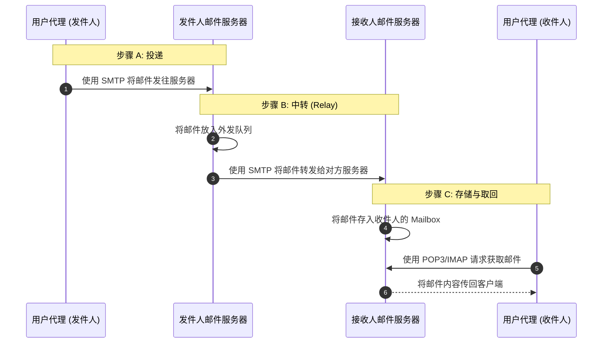
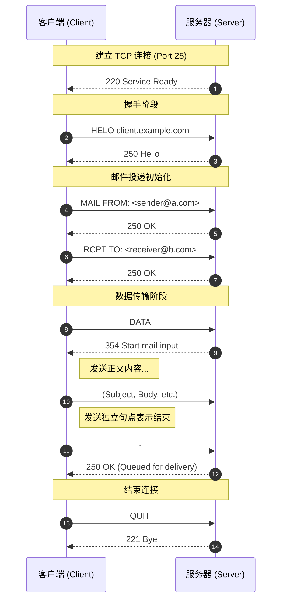

---
title: 电子邮件
description: 电子邮件系统的组成与SMTP/POP3/IMAP协议
published: 2026-06-27
category: 计算机网络
tags:
    - 计算机网络
---
# 主要组成部分

- **用户代理（User Agent，简称 UA）** 是用户与邮件系统交互的“第一站”。
	- 本地客户端 (Client-based)
	- Web 浏览器界面 (Web-based)
- 邮件服务器
	- **邮箱（Mailbox）：** 这是服务器硬盘上的一块空间，专门属于你。
	    - 所有发给你的信件都会暂时存放在这里，直到你通过用户代理（如 Outlook）把它们取走或在线阅读。
	- **外发邮件队列（Outgoing Message Queue）：**
	    - 当你点击“发送”时，邮件并不会瞬间直接传到对方电脑，而是先进入服务器的这个队列。
	    - 服务器会尝试联系对方的邮件服务器。如果对方服务器暂时宕机，你的服务器会把邮件存在队列里，过一会儿再试。
- SMTP: 简单邮件传输协议

## 邮件传输流程

- Alice 在她的邮件客户端（如 Outlook 或 Web Gmail）输入收件人地址 `bob@someschool.edu` 并写好内容。此时邮件还只存在于 Alice 的电脑内存中。
- Alice 的用户代理通过 **SMTP** 将邮件推送到她所属的邮件服务器。邮件进入发件服务器的 **邮件队列 (Queue)**。
- Alice 的服务器（SMTP 客户端）根据收件人地址的域名（someschool.edu），通过 **DNS 解析**找到对方服务器的 IP，并建立 **TCP 连接**。
- Alice 的服务器作为 SMTP 客户端，通过步骤 3 建立的通道，把邮件发送给 Bob 的邮件服务器。
- Bob 的服务器收到邮件，根据收件人用户名，将其放入 Bob 的 **个人邮箱 (Mailbox)** 中。
- Bob 运行他的用户代理（如手机端的 Mail app），从服务器下载或同步邮件。**这里不再使用 SMTP！** 通常使用的是 **POP3** 或 **IMAP** 协议（或者是 Web 端使用的 HTTP）。


# SMTP

- **SMTP（Simple Mail Transfer Protocol，简单邮件传输协议）** 是电子邮件系统中负责“发送”和“中转”的核心协议,**在邮件服务器之间发送邮件**的协议
- **应用层协议：** 运行在 TCP/IP 协议族的应用层。
- **传输层基础：** 使用 **TCP** 协议保证传输的可靠性，标准端口是 **25**（加密版本常使用 465 或 587）。
- **“推”（Push）协议：** SMTP 是一种主动行为。发件人将邮件“推”向服务器，发件人服务器再将邮件“推”向收件人服务器。
- **文本驱动：** SMTP 的指令和响应全是简单的 **ASCII 文本**。
- SMTP是持久连接的
- HTTP：每个对象封装在各自的响应报文中 
- SMTP: 多个邮件内的对象被包含在一个邮件中（有格式的多组成部分）

## 流程




### 建立 TCP 连接/握手

- SMTP 客户端（通常是你的发件服务器）通过 **25 端口**（或加密的 465/587 端口）与接收方服务器建立 TCP 三次握手。
- 建立连接后，服务器会主动发送一个状态码 `220`，表示“我已准备好为你服务”。

- 客户端向服务器打招呼并自我介绍。
- **客户端指令：** `HELO <发件方域名>`（或扩展协议中的 `EHLO`）。
- **服务器响应：** `250 OK`，表示认领了身份。

### SMTP 传输邮件阶段

- **指定路径：** 
	* `MAIL FROM: <sender@abc.com>` (告知回信地址)
    - `RCPT TO: <receiver@xyz.com>` (告知目的地)
- **内容传输：** 
	* 客户端发送 `DATA`。
    - 服务器响应 `354`（允许开始输入）。
    - 客户端发送邮件正文（包括 Subject, From, To 等 Header 和 Body）。
- **结束信号：** 客户端发送一个**独立行中的句点 `.`**，服务器返回 `250 OK` 表示已存入队列。

### SMTP 关闭

完成任务后，礼貌地断开 TCP 连接。
- **主要命令：** `QUIT`。
- **服务器响应：** `221 Service closing transmission channel`。
- **目的：** 释放系统资源，正式断开底层的 TCP 连接。

## 邮件报文格式

- 它由三个主要部分组成：**首部（Headers）**、**空行**、**正文（Body）**。

### 邮件首部 (Message Headers)

首部包含了关于邮件的元数据。每一行都由一个关键字、一个冒号和对应的值组成（Keyword: Value）。
最常见的标准首部包括：
- **From:** 发件人的邮件地址。
- **To:** 收件人的邮件地址。
- **Subject:** 邮件的主题（这是可选的，但几乎所有邮件都有）。
- **Date:** 邮件撰写的日期和时间。
- **Cc / Bcc:** 抄送和密送。

> **注意：** 邮件首部中的 `From` 和 `To` 属于**信件内容**，由用户代理（UA）生成；而 SMTP 命令中的 `MAIL FROM` 和 `RCPT TO` 属于**传输信封**。这就像信封上的地址和信纸抬头写的“亲爱的某某”是两回事。


### 空行 (Blank Line)

- 这是报文格式中最简单但最不可或缺的部分。
- 在首部的最后一行之后，必须有一个**完全空白的行**（仅包含回车换行符 `\r\n`）。


### 邮件正文 (Message Body)

这是邮件的实际内容，通常是纯文本。
- 在最初的协议中，正文只能是 7 位的 ASCII 码。
- 如果你要发送中文、图片、视频或 HTML 排版，就需要用到 **MIME 扩展**。

### MIME 扩展 (多用途互联网邮件扩展)

由于原始邮件格式只能传简单的英文文本，为了支持多媒体，引入了 **MIME (RFC 2045-2049)**。
MIME 在邮件首部增加了几个关键字段，让浏览器或客户端知道如何处理这些二进制数据：
- **MIME-Version:** 声明支持 MIME 协议（通常是 1.0）。
- **Content-Type:** 声明正文的类型（如 `text/html`，`image/jpeg` 或 `application/pdf`）。
- **Content-Transfer-Encoding:** 声明编码方式（如 `base64` 或 `quoted-printable`）。因为 SMTP 只能传文本，所以图片必须转成一串长长的 Base64 文本。
- **Boundary:** 当一封邮件既有文本又有附件时（`multipart/mixed`），通过这个“边界字符串”来切分不同的部分。

# MAP

- 在电子邮件系统中，**邮件访问协议（Mail Access Protocol）** 负责流程的“最后一公里”：**将邮件从接收方邮件服务器的邮箱（Mailbox）中提取到用户的终端设备（手机、电脑）上。**
- 正如我们之前讨论的，SMTP 是一个**推（Push）** 协议， 而邮件访问协议则是**拉（Pull）** 协议。
- 目前最常用的访问协议有三种：**POP3**、**IMAP** 和 **HTTP**。

### POP3 (Post Office Protocol - Version 3)

POP3 就像传统的“邮局”模式：你把信取走，邮局就不再留底了。
- **工作模式：** 下载并删除（Download-and-Delete）。一旦客户端下载了邮件，服务器上的副本通常会被删除。 
- **优点：** 简单、对服务器存储压力小。
- **缺点：** 极度不适合多设备同步。如果你在电脑上收了信，手机上就看不到了。
- **端口：** 110（加密版 995）。

### IMAP (Internet Message Access Protocol)

IMAP 就像现在的“云端”模式：你的所有操作都在服务器上同步。
- **工作模式：** 在线交互。它在本地只缓存副本，所有的文件夹创建、删除、已读标记都会同步回服务器。
- **优点：** 完美支持多设备（手机、电脑、网页版看到的状态一模一样）。
- **缺点：** 协议极其复杂，对服务器性能和存储要求高。
- **端口：** 143（加密版 993）。


### HTTP (Webmail)

这就是我们平时用的网页版邮箱（如 Gmail, QQ 邮箱网页版）。
- **工作模式：** 浏览器作为用户代理，通过 HTTP/HTTPS 协议与邮件服务器通信。
- **特点：** 不需要配置任何客户端，有浏览器就能用。

# POP流程

### 1. 认证阶段 (Authorization Phase)

这是连接建立后的第一步，目的是确认用户的身份。
- **主要指令：** `USER`（用户名）、`PASS`（密码/授权码）。
- **服务器响应：** `+OK`（成功）或 `-ERR`（失败）。

### 2. 事务处理阶段 (Transaction Phase)

身份验证通过后，用户可以查看邮件列表并下载。
- **主要指令：**
    - `STAT`：查看邮箱状态（邮件总数和总大小）。
    - `LIST`：列出邮件编号和各自的大小。
    - `RETR [编号]`：读取（下载）指定编号的邮件。
    - `DELE [编号]`：标记删除指定编号的邮件。
    - `RSET`：重置，撤销本阶段所有的删除标记。
        

### 3. 更新阶段 (Update Phase)

当用户输入 `QUIT` 指令后进入此阶段。
- **关键动作：** 服务器正式物理删除那些被标记为 `DELE` 的邮件，并断开 TCP 连接。
- **注意：** 如果你在事务处理阶段突然断网（未发送 `QUIT`），服务器通常**不会**删除那些标记了 `DELE` 的邮件。

- 假设 Alice 要从服务器取回她的邮件，以下是完整的命令行对话（`C:` 代表客户端，`S:` 代表服务器）：
```
S: +OK POP3 server ready <mail.example.com>
C: USER alice
S: +OK
C: PASS p@ssw0rd123
S: +OK Alice's maildrop has 2 messages (3200 octets)

C: STAT
S: +OK 2 3200

C: LIST
S: +OK 2 messages (3200 octets)
S: 1 1500
S: 2 1700
S: .

C: RETR 1
S: +OK 1500 octets
S: (这里是第一封邮件的完整报文内容，包括 Headers 和 Body)
S: .

C: DELE 1
S: +OK message 1 deleted

C: QUIT
S: +OK Farwell (maildrop populated)
```

在实际应用中，POP3 客户端通常有两种配置方式，这决定了它在“更新阶段”的行为：
1. **“下载并删除”模式 (Download-and-Delete)：**
    - 客户端在 `RETR` 之后紧跟一个 `DELE` 指令。
    - **后果：** 邮件一旦被电脑取走，服务器上就没了。这是 POP3 的原始设计，导致你换台手机就看不到旧邮件。
2. **“下载并保留”模式 (Download-and-Keep)：**
    - 客户端下载邮件后**不发送** `DELE` 指令。
    - **后果：** 邮件依然留在服务器上，虽然变相实现了“多设备查看”，但比起 IMAP 依然很笨拙（无法同步“已读/未读”状态）。
- POP3在会话中是无状态的。
