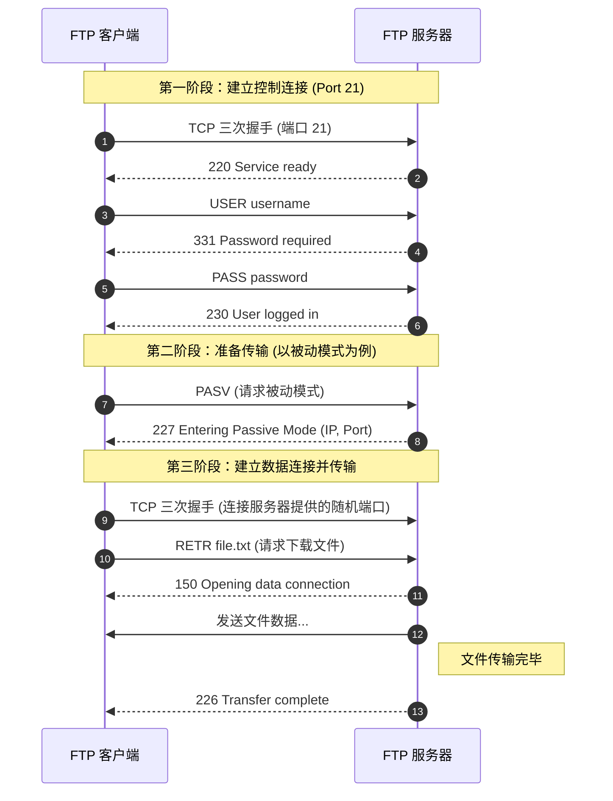

---
title: FTP文件传输协议
description: FTP文件传输协议的双通道架构与工作原理
published: 2026-06-27
category: 计算机网络
tags:
    - 计算机网络
---

- **FTP（File Transfer Protocol，文件传输协议）** 是互联网上最古老、最常用的文件传输协议之一。它属于 TCP/IP 协议族中的**应用层**协议，专门用于在客户端和服务器之间进行文件的双向传输。
- FTP 是一个**双通道**协议，它需要两个并行的 TCP 连接来完成工作。

## 控制连接

- **控制连接 (Control Connection)：端口 21**
- 用于传输控制信息（如用户名、密码、命令如 `ls`、`get`、`put`）。
- 在整个 FTP 会话期间始终保持开启。

## 数据连接

- **数据连接 (Data Connection)：端口 20 (或随机端口)**
- 专门用于传输实际的文件内容或目录列表。
- 只有在需要传输数据时才建立，传输完成后立即关闭。

## 主动与被动模式

**它们的区别在于：谁主动发起了数据连接的请求。**

### 主动模式 (Active Mode / PORT)

1. **客户端**告知服务器：“我已经在某个端口开启了监听，你来连我吧。”
2. **服务器**从自己的 **20 端口**主动发起连接，连向客户端提供的端口。
- **痛点：** 如果客户端在防火墙后面，防火墙通常会拦截来自服务器的“主动入站”请求，导致连接失败。
    
### 被动模式 (Passive Mode / PASV) —— 现代常用

1. **客户端**询问服务器：“我怎么连你？”
2. **服务器**开启一个随机的高位端口，并告诉客户端：“你来连我的这个端口。”
3. **客户端**主动发起连接。
- **优点：** 对客户端防火墙友好，因为这是客户端发起的“出站”请求，大多数防火墙都会放行。

