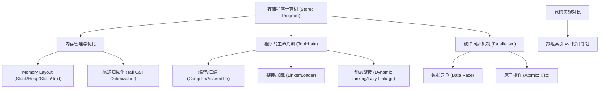
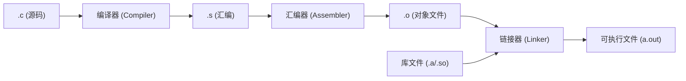

# 程序的编译、链接、加载与并行同步 · 复习笔记

> 一句话总览：本讲揭示了程序从高级语言转化为可执行指令的生命周期，并重点探讨了内存布局优化及多处理器环境下的原子同步机制。

## 知识地图



---

## 1. 内存布局与函数调用优化

### 是什么
计算机将程序指令和数据一并存放在内存中（**Stored Program**），系统通过特定的内存划分来组织它们。

- **内存四段论**：
    - **Text (代码段)**：存放二进制指令。
    - **Static Data (静态区)**：全局变量、常量。通过 `$gp` 寄存器快速访问。
    - **Heap (堆)**：动态分配（`malloc`, `new`），向上增长。
    - **Stack (栈)**：局部变量、函数帧，向下增长。

### 尾递归优化 (Tail Recursion Optimization)
- **为什么需要**：普通递归每次调用都要压栈，深度过大时会导致 `Stack Overflow`。
- **怎么做**：如果子程序的调用是函数的**最后一步**（尾调用），编译器可以将 `jal`（调用）优化为 `j`（跳转）。
- **效果**：复用当前的栈帧，将递归转化为**循环**，空间复杂度从 $O(n)$ 降至 $O(1)$。

---

## 2. 并发同步：解决“数据竞争”

### 为什么会有问题 (Data Race)
在多核处理器中，当两个线程并行执行 `count++` 时：
1. 线程 A 读取 count (1000)
2. 线程 B 读取 count (1000)
3. 线程 A 写入 1001
4. 线程 B 写入 1010
**结果**：两次增加只生效了一次。这就是由于非原子操作导致的数据竞争。

### 硬件解决方案：MIPS 原子指令
MIPS 不提供单条“原子加法”指令，而是提供**一对**指令组合：

1. **`ll` (Load Linked)**：读取值，并在硬件中打上一个“监控标记”。
2. **`sc` (Store Conditional)**：
   - 尝试写入新值。
   - **检查**：如果自 `ll` 以来，该地址没被改动，则写入成功（寄存器返回 1）。
   - **失败**：如果标记已失效，则写入失败（寄存器返回 0），需要程序循环重试。

---

## 3. 程序的转化：从源码到运行

### 编译工具链 (Toolchain)


### 关键组件
- **对象文件 (.o)**：包含机器码、符号表（记录全局变量和函数位置）和重定向信息。
- **链接器 (Linker)**：将多个 `.o` 合并，解析外部符号，修补跳转地址。
- **加载器 (Loader)**：将磁盘上的程序搬入内存，初始化寄存器（如 `$sp`, `$gp`），跳转至 `main`。

### 动态链接与延迟加载 (Lazy Linkage)
- **是什么**：程序运行时才链接库函数（如 `printf`）。
- **为什么**：减小文件体积，便于库更新。
- **机制**：第一次调用时跳转到 **Stub**，通过 **Linker/Loader** 找到地址并填充 **Indirection Table**，后续调用直接跳转。

---

## 4. 数组 vs 指针：底层的选择

### 对比总结
| 维度 | 数组下标方式 | 指针移动方式 |
| :--- | :--- | :--- |
| **底层实现** | 每次循环都要 `i * 4 + base` | 每次循环仅 `ptr + 4` |
| **性能** | 往往需要 3+ 条指令定位地址 | 仅需 1 条加法指令推演地址 |
| **编译器优化** | 现代编译器能自动转换（归纳变量消除） | 手写指针更直接但易错 |

---

## 自测题

### 一、选择题

**1. 在多处理器环境下，实现互斥锁的关键特征是？**

A. 禁用所有中断    B. 操作的原子性 (Atomicity)    C. 增加缓存容量    D. 使用静态变量

<details>
<summary>答案与解析</summary>

**答案：B**

**解析**：禁用中断在多核环境下无效。同步的核心必须保证“读-改-写”过程不被其他处理器插队，这必须通过硬件支持的原子操作（如 MIPS 的 `ll/sc`）来实现。
</details>

**2. 动态链接中的 "Lazy Linkage" 指的是？**

A. 编译时链接所有库    B. 只有当函数被实际调用时才解析地址    C. 自动删除不用的代码    D. 提高 CPU 主频

<details>
<summary>答案与解析</summary>

**答案：B**

**解析**：Lazy Linkage（延迟链接）通过 Stub 机制，确保只有程序运行到相关代码处才进行地址替换，节省启动时间和内存。
</details>

### 二、简答题

**1. 简述尾递归优化的原理及其带来的好处。**

<details>
<summary>参考答案</summary>

- **原理**：当递归调用是函数的最后一条执行指令时，之前的栈帧状态不再重要，编译器可以将 `jal`（调用并保存返回地址）替换为普通的 `j`（跳转），复用当前栈帧。
- **好处**：1. 节省内存空间，空间复杂度从 O(n) 变为 O(1)；2. 避免栈溢出错误；3. 减少了入栈出栈的开销。
</details>

### 三、计算与汇编理解

**1. 假设 `$s1` 存放锁的地址，`$s4` 存放新值。请解读以下 MIPS 代码的作用：**
```assembly
try: ll  $t1, 0($s1)
     sc  $s4, 0($s1)
     beq $s4, $zero, try
```

<details>
<summary>解答过程</summary>

1. **`ll $t1, 0($s1)`**：加载锁的当前值到 `$t1` 并建立硬件链接监视。
2. **`sc $s4, 0($s1)`**：尝试将新值 `$s4` 存回。如果期间 `$s1` 被其他核动过，`$s4` 会被硬件置为 0。
3. **`beq $s4, $zero, try`**：检查写入状态。如果 `$s4` 为 0（失败），则跳转回 `try` 重新尝试。
**结论**：这是实现原子交换（Atomic Swap）或获取锁的典型写法。
</details>
