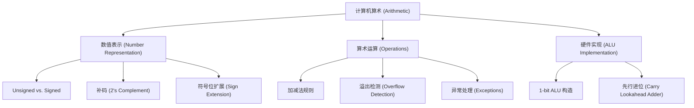

# 计算机算术 (Computer Arithmetic) · 复习笔记

> 一句话总览：本讲深入探讨了数值在硬件底层的二进制表示逻辑（重点是补码），分析了算术运算（加减法）的溢出本质，并揭示了 ALU 如何通过先行进位（Carry Lookahead）在硬件层面平衡计算速度与复杂度。

## 知识地图

---

## 1. 数值表示：为什么是补码？

### 是什么
计算机内部使用 **补码 (2's Complement)** 来表示有符号整数。

- **定义**：最高位（MSB）权重为 $-2^{n-1}$，其余位权重与无符号数相同。
	- 示例：`1111...1111` 为 $-1$，`1000...0000` 为 $-2^{31}$ (最小负数)。
- **转换捷径**：求 $-x$ 的补码 = $x$ 每一位取反 + 1。

### 为什么选择补码？
1. **加减法统一**：减去一个数等于加上它的负值补码，硬件只需要加法器。
2. **逻辑一致性**：`x + (-x) = 2^n`（在 n 位带宽下溢出后结果为 0）。
3. **消除 +0 和 -0**：相比原码和反码，补码只有一个 0 的表示，节省了一个码位并简化了判断逻辑。

### 符号位扩展 (Sign Extension)
- **场景**：将 16 位常数（immediate）转换为 32 位进行运算时。
- **规则**：用原数的最高位（符号位）填充左侧所有新增位。
	- 正数扩展补 0，负数扩展补 1。

---

## 2. 溢出 (Overflow) 的本质与检测

### 为什么会溢出
溢出的本质是 **运算结果超出了当前位宽能表示的范围**。补码运算实际上是一个 **模运算系统 ($mod\ 2^n$)**。

- **发生场景**：
	- 两正数相加得到负数（正溢出）。
	- 两负数相加得到正数（负溢出）。
	- **一正一负相加绝不会溢出**。

### 硬件检测逻辑
1. **逻辑判断**：检查操作数与结果的符号位变化。
2. **进位特性 (高效检测)**：
	- **判据**：最高位的进位输入 ($CarryIn_{MSB}$) 与最高位的进位输出 ($CarryOut_{MSB}$) 不一致。
	- **公式**：$Overflow = CarryIn_{n-1} \oplus CarryOut_{n-1}$。

### 溢出处理
- **MIPS 指令区分**：
	- `add`, `addi`, `sub`：发生溢出时会触发 **Exception (异常)**，调用异常处理器。
	- `addu`, `addiu`, `subu`：忽略溢出，常用于 C 语言（C 通常忽略溢出）。

---

## 3. ALU 的硬件实现与优化

### 1-bit ALU 的组成
一个基础的 1 位 ALU 由以下模块构成：
- **逻辑门**：支持 `AND`, `OR`。
- **全加器 (Full Adder)**：支持 `Addition`。
- **多路选择器 (MUX)**：根据操作码选择输出。
- **反相控制**：通过 `Binvert` 实现减法（补码逻辑：加反加 1）。

### 性能瓶颈：行波进位加法器 (Ripple Carry Adder)
- **问题**：高位的运算必须等待低位的进位信号，延迟随位数 $n$ 线性增长 ($O(n)$)。

### 性能飞跃：先行进位 (Carry Lookahead)
- **核心思想**：通过增加硬件逻辑，提前“预测”每一位是否会产生进位。
- **两级逻辑**：
	- **生成项 (Generate, $G_i$)**：$G_i = A_i \cdot B_i$ (当前位一定会产出进位)。
	- **传递项 (Propagate, $P_i$)**：$P_i = A_i + B_i$ (如果低位进来了，我就传给高位)。
- **进位方程**：$C_{i+1} = G_i + P_i \cdot C_i$。
- **结果**：极大地缩短了关键路径延迟，将 $O(n)$ 降至近似 $O(\log n)$。

---

## 自测题

### 一、选择题

**1. 在 8 位补码系统中，执行 `127 + 1` 会得到什么结果？**

A. 128    B. -128    C. -127    D. 0

答案与解析

**答案：B**

**解析**：8 位补码最大正数为 127 (`01111111`)。加 1 后变为 `10000000`。在补码系统中，`10000000` 表示 $-2^7 = -128$。这是一个典型的正溢出。

**2. 只有哪类指令在发生溢出时会向操作系统抛出异常？**

A. 带 `u` 后缀的指令 (如 `addu`)    B. 不带 `u` 后缀的指令 (如 `add`)    C. 所有的逻辑指令    D. 无符号指令

答案与解析

**答案：B**

**解析**：MIPS 设计中，`add`, `sub` 是为有符号算术设计的，必须检测并处理溢出；而 `addu`, `subu` 被视为地址运算或忽略溢出的算术，不触发异常。

### 二、简答题

**1. 补码系统如何利用加法器来实现减法运算 `A - B`？**

参考答案

1. 根据补码定义，`A - B` 等效于 `A + (-B)`。
2. 求 `-B` 的补码即“按位取反再加 1”。
3. 在硬件 ALU 中，将 B 的每一位通过 `Binvert` 信号取反，并将加法器的最低位进位输入 `CarryIn_0` 设置为 1，从而实现“加 1”的操作。

### 三、逻辑推演题

**1. 写出先行进位加法器中，第 2 位进位 $C_2$ 的逻辑表达式（用 $G, P, C_0$ 表示）。**

解答过程

1. 基础递推式：$C_1 = G_0 + P_0 \cdot C_0$
2. 代入 $C_2$：$C_2 = G_1 + P_1 \cdot C_1$
3. 展开并整理：
   **$C_2 = G_1 + P_1(G_0 + P_0 \cdot C_0) = G_1 + P_1 \cdot G_0 + P_1 \cdot P_0 \cdot C_0$**
   （这表明 $C_2$ 可以在两级逻辑门延迟内直接由输入计算得出，无需等待 $C_1$ 完成）。

