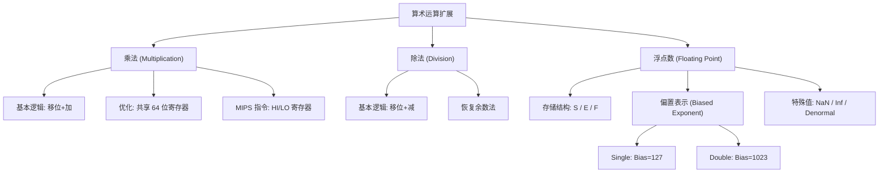

# 乘除法运算与浮点数标准 (IEEE 754) · 复习笔记

> 一句话总览：本讲揭示了计算机如何通过“移位+加减”实现复杂的乘除运算，并详细解读了 IEEE 754 浮点数标准的存储结构、数值范围及特殊状态（NaN/Inf）。

## 知识地图

---

## 1. 乘法运算 (Multiplication)

### 基本逻辑
乘法本质上是 **连续的“检查-加法-移位”** 过程。
- **检查**：看乘法器的当前位。若是 1，则加上被乘数；若是 0，则跳过。
- **移位**：被乘数左移（或中间积右移），为下一位权重做准备。

### 硬件优化：共享寄存器
- **痛点**：初始设计需要 64 位加法器和冗余空间。
- **方案**：将 64 位寄存器的左半部分定义为“中间积 (Product)”，右半部分定义为“乘数 (Multiplier)”。随着乘数位被逐个消耗（右移），腾出来的空间正好用来存放增长的乘积位。
- **结论**：只需要 **32 位加法器** 即可完成 32x32 乘法。

### MIPS 指令
- `mult rs, rt` / `multu rs, rt`：结果存入特殊的 **HI (高 32 位)** 和 **LO (低 32 位)** 寄存器。
- `mfhi rd` / `mflo rd`：将结果搬运到通用寄存器使用。

---

## 2. 除法运算 (Division)

### 核心步骤
除法是乘法的逆过程，采用**“移位-减法-尝试”**逻辑。
1. **左移**余数寄存器。
2. **减法**：余数减去除数。
3. **判断**：
    - 若结果 $\ge 0$：商存入 1。
    - 若结果 $< 0$：写入失败，恢复原余数（Restore），商存入 0。

### 硬件实现
- 与乘法类似，除法也可以通过共享 64 位寄存器优化。
- **MIPS 特点**：`div` 指令不进行溢出或除以 0 检查，软件需自行判断。
- **结果存放**：HI 存**余数 (Remainder)**，LO 存**商 (Quotient)**。

---

## 3. 浮点数表示：IEEE 754 标准

### 是什么
为了表示极大或极小的数，计算机采用类似“科学计数法”的存储方式：
$$Value = (-1)^S \times (1 + Fraction) \times 2^{(Exponent - Bias)}$$

- **S (Sign)**：1 位符号位。
- **E (Exponent)**：阶码。使用**偏置表示法 (Biased)**，以便于硬件直接比较大小。
    - Single (32-bit): 8 位阶码, **Bias = 127**。
    - Double (64-bit): 11 位阶码, **Bias = 1023**。
- **F (Fraction)**：尾数。隐藏了首位的 `1.`（标准化数）。

### 为什么指数要加 Bias？
- **动机**：若指数使用补码，负指数的二进制码看起来比正指数大（如补码 1...1 是 -1）。
- **解决**：加一个偏置值，将 $[-126, 127]$ 映射到无符号数 $[1, 254]$，使得阶码大的数在二进制比较时也大，简化了硬件比较电路。

### 精度对比
- **单精度**：约 23 位尾数，对应约 **7 位** 十进制精度。
- **双精度**：约 52 位尾数，对应约 **16 位** 十进制精度。

---

## 4. 特殊数值与异常状态

| 状态 | Exponent (E) | Fraction (F) | 意义 |
| :--- | :--- | :--- | :--- |
| **Zero** | 00...0 | 0 | 真正的 0 |
| **Denormal** | 00...0 | $\neq 0$ | 极小的数 (渐进下溢)，隐藏位为 `0.` |
| **Infinity** | 11...1 | 0 | $\infty$ (如 1.0 / 0.0)，可参与运算 |
| **NaN** | 11...1 | $\neq 0$ | 非数 (Not a Number, 如 0.0 / 0.0)，指示错误 |

---

## 自测题

### 一、选择题

**1. 在 MIPS 乘法指令 `mult $s1, $s2` 执行后，乘积的低 32 位被存储在哪个寄存器中？**

A. $s1    B. $v0    C. LO    D. HI

答案与解析

**答案：C**

**解析**：MIPS 专门为乘除法设计了 HI 和 LO 寄存器。乘法中，LO 存低 32 位，HI 存高 32 位；除法中，LO 存商，HI 存余数。

**2. IEEE 754 单精度浮点数中，阶码 (Exponent) 全为 1 且尾数 (Fraction) 不为 0 表示什么？**

A. 无穷大 (Infinity)    B. 非数 (NaN)    C. 0    D. 溢出

答案与解析

**答案：B**

**解析**：根据标准，E 为全 1 且 F 为 0 时是 Infinity；只要 F 不为 0，无论符号位是多少，都是 NaN。

### 二、简答题

**1. 为什么 IEEE 754 标准要将 1.x 中的 "1" 隐藏起来不存储？**

参考答案

- **原理**：在二进制科学计数法中，任何非零的标准化数（Normalized number）第一位必然是 1。
- **好处**：既然它固定是 1，就不必占用存储空间。这样可以将原本 23 位的有效位扩展为 24 位精度（相当于多出了 1 位的精度）。

### 三、计算题

**1. 已知一个单精度浮点数的十六进制表示为 `0xC0A00000`，求它对应的十进制值。**

解答过程

1. **二进制展开**：`1 10000001 0100000...`
2. **提取分量**：
   - S = 1 (负数)
   - E = `10000001` = 129
   - F = `0.01` (二进制) = 0.25 (十进制)
3. **公式代入**：
   - 指数部分 = $129 - 127 = 2$
   - 尾数部分 = $1 + 0.25 = 1.25$
4. **计算结果**：$(-1) \times 1.25 \times 2^2 = -5.0$

