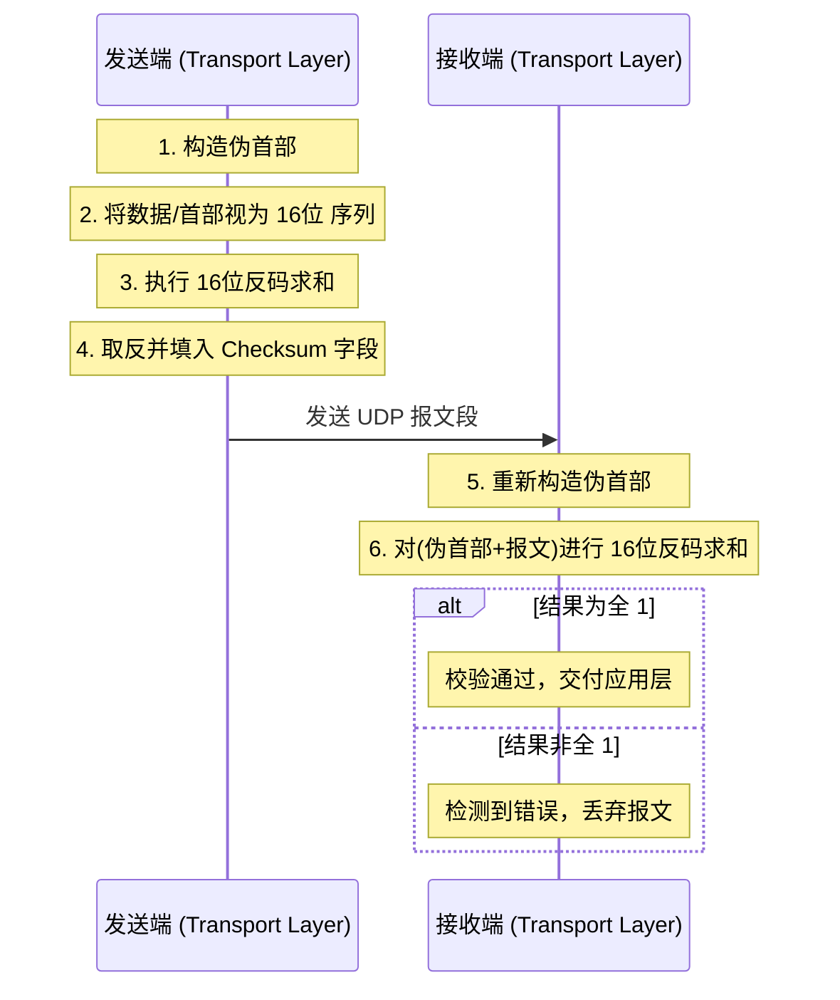

---
title: UDP用户数据报协议
description: UDP无连接传输协议的特性与应用场景
published: 2026-06-27
category: 计算机网络
tags:
    - 计算机网络
---

- **UDP（User Datagram Protocol，用户数据报协议）** 是一种在**传输层**工作的**无连接（Connectionless）**、**不可靠**的传输协议。

## UDP 的核心特性

- **无连接**：发送数据前不需要像 TCP 那样进行“三次握手”建立连接。想发就发，发完拉倒。
- **不可靠交付**：它不保证数据一定能到达目的地，也不保证到达的顺序，更没有重传机制。
- **面向报文**：UDP 对应用层交下来的报文，既不拆分也不合并，而是保留这些报文的边界
- **无拥塞控制**：网络再堵，UDP 也会按照原来的速率发送（除非应用层干预）。这对于实时性要求高的应用（如视频通话）非常重要。

## 为什么 UDP 是必要的？（存在的价值）

既然 UDP 这么“不靠谱”，为什么不全部改用 TCP 呢？原因在于 TCP 的“可靠性”是有代价的，在某些特定场景下，UDP 的优势是无可替代的：

### 极致的速度与效率

TCP 为了保证可靠，需要消耗大量的计算资源和网络带宽（确认应答、序列号、流量控制等）。UDP 的首部只有 **8 个字节**，而 TCP 至少需要 **20 个字节**。在一些微小的查询（如 DNS）中，UDP 能够瞬间完成响应，而不需要浪费时间去建立和拆除连接。

### 实时性优先（宁可丢包，不能卡顿）

在**实时视频会议、在线直播、网络游戏**中，时延是最大的敌人。
- 如果使用 TCP，一个包丢了，后面所有的包都要停下来等这个包重传（头部阻塞）。这会导致画面卡死。
- 使用 UDP，丢掉一帧画面可能只是轻微的花屏，但后续画面能立即跟上，保证了通话的连续性。

### 支持广播和多播

TCP 只能是一对一的通信。如果你想给局域网内的所有电脑发消息，或者进行视频组播，TCP 无法胜任，只有 UDP 具备**一对多**的传输能力。

### “轻量级”让应用层拥有掌控权

很多现代协议（如 Google 开发的 **QUIC**，即 HTTP/3 的基础）选择基于 UDP 构建。这是因为 UDP 足够简单，像一张白纸，开发者可以在应用层自己定义如何处理丢包和重传，而不需要受限于操作系统内核中死板的 TCP 算法。

# 报文段结构

- **源端口号 / 目的端口号**:这是的分用键。**接收方靠目的端口号把报文段交给正确的套接字**。源端口号供接收方"**反向回信**"时使用(如果应用需要的话)。
- **长度**:UDP 报文段的**总字节数**(**头部 + 数据**)。最小值是 8(只有头部、数据为空),最大值理论上是 65535,但实际会受 IP 层 MTU 限制。
- **校验和**:UDP 唯一的"可靠性"机制。发送方把头部 + 数据 + IP 伪头部当作一串 16 位整数做反码求和;接收方做同样运算验证。**只要一位翻转,校验和就会对不上,接收方会直接丢弃这个数据报**——但**它不会通知发送方,也不会请求重传**,数据就这么"悄无声息地"消失了。

> 顺带一提:伪头部包含源 IP、目的 IP、协议号等。这是 UDP "越权"看了 IP 层信息的少数几处之一,目的是让校验和能检测出 IP 寻址错误送到的情况。

# 收发流程

# 校验和

- 它的主要作用是提供一种**端到端**的差错检测机制，用于检测 UDP 报文段在从源主机到目的主机的传输过程中，是否因为物理链路噪声或路由器内存故障等原因产生了比特错误。

## 关键组成部分：伪首部 (Pseudo Header)

在计算校验和时，UDP 不仅计算报文本身，还会引入一个 **12 字节的伪首部**。
- **目的**：确保 UDP 报文不仅内容正确，而且确实是发往正确的 IP 地址和协议（防止 IP 层错误地将包递交给 UDP）。
- **构成**：源 IP 地址（4字节）、目的 IP 地址（4字节）、全零字段（1字节）、协议号（1字节，UDP 为 17）、UDP 长度（2字节）。

## 校验和的计算算法：16 位反码求和

UDP 使用的算法非常经典，称为 **16 位反码求和（Ones' Complement Sum）**。

### 计算步骤（发送端）：

1. **准备数据**：将伪首部、UDP 首部、应用数据全部看作是由 16 位的字（Words）组成的序列。
2. **填充**：如果数据的总字节数是奇数，则在末尾补一个全零字节（仅用于计算，不发送）。
3. **求和**：将所有 16 位的字相加。
    - **进位回填**：如果相加结果溢出了（产生了第 17 位），则将溢出的进位（Carry）加回结果的最低位。
4. **取反**：将最终的和按位取反（1 变 0，0 变 1），这个结果就是校验和。
5. **填入头部**：将结果放入 UDP 报文的 Checksum 字段。

### 验证步骤（接收端）：

接收端收到报文后，会将 **伪首部 + UDP 报文（含校验和）** 再次进行 16 位反码求和。
- **结果判断**：如果计算出的结果全为 1（二进制：`1111111111111111`），则说明传输过程中没有检测到错误。
- **处理**：如果结果不全为 1，说明数据已损坏，UDP 通常会直接丢弃该报文。

