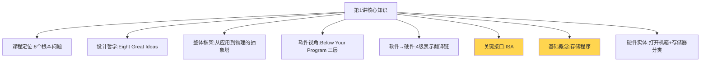
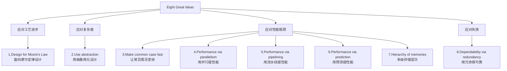
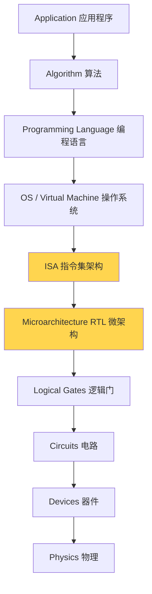
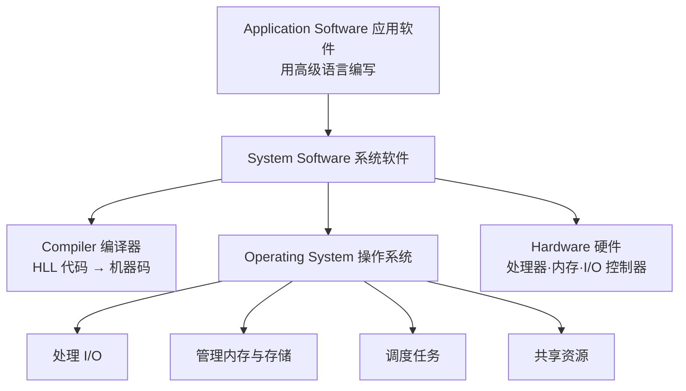
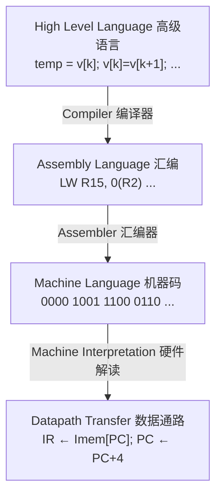
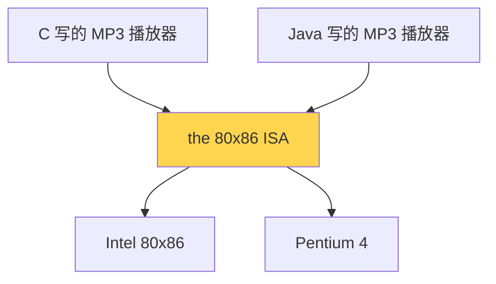
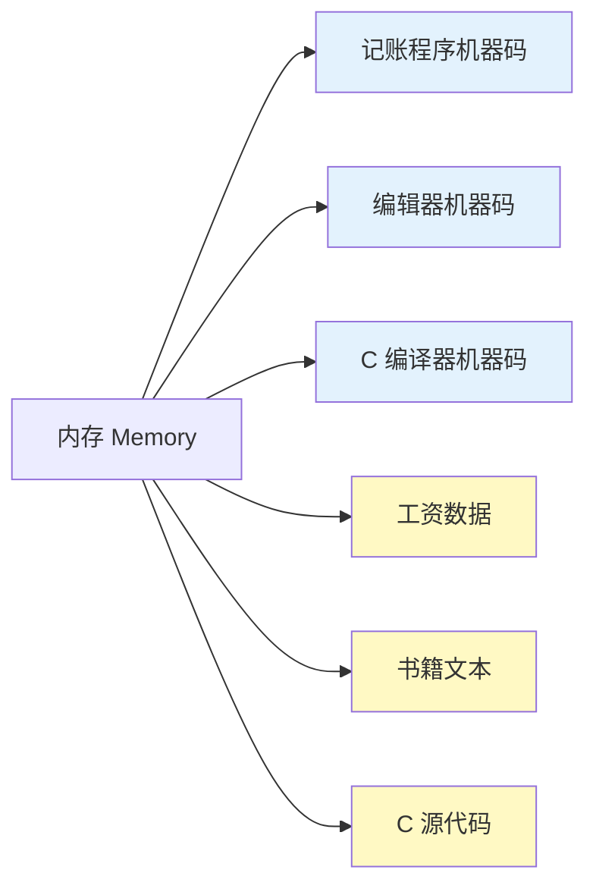
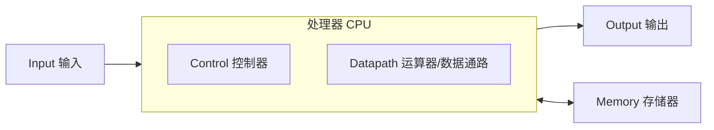
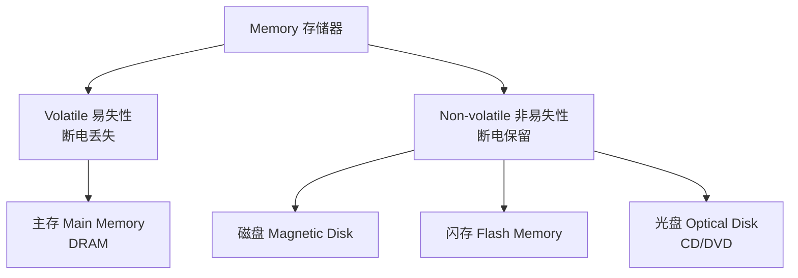

# 第 1 讲 · 计算机抽象与技术 · 复习笔记

> **一句话总览**：计算机系统结构是一门"设计抽象层"的学科——把"应用"和"物理器件"之间的鸿沟拆成多层中间表示，每层向上提供方便、向下高效实现，其中最关键的接口叫 **ISA（指令集架构）**。

## 知识地图

⭐ **黄色 = 核心考点**

---

## 1. 课程定位:这门课要回答什么

### 是什么

不是教写代码,而是教"代码下面发生了什么"。课程围绕 8 类根本问题:

| 问题层 | 具体问题 |
| --- | --- |
| 计算本质 | 计算机如何计算?基本部件是什么?如何解读机器码? |
| 软硬交接 | 软件和硬件如何交接? |
| 执行机制 | 程序如何执行? |
| 性能与并行 | 如何让程序更快?如何并行?如何评价性能? |

### 为什么这样组织

8 个问题不是并列的,而是**层层递进**:不知道"基本部件",就没法谈"如何让它更快";不理解"程序如何执行",就没法谈"并行"。

---

## 2. Eight Great Ideas — 8 大设计思想 ⭐

### 是什么

计算机体系结构 60 年来反复出现的 8 个设计原则。理解后续任何具体技术(流水线、Cache、并行、预测)都能归到其中一两条。

### 按"应对什么挑战"分组

### 逐条解读

1. **面向摩尔定律(Moore's Law)**:芯片设计周期 2–5 年,但摩尔定律每 18–24 月晶体管翻倍——**设计目标要瞄准完工时的工艺**,不是开工时的。
2. **抽象(Abstraction)**:藏起下层细节,上层只用接口。这是整个学科的方法论。
3. **常见情况快(Common case fast)**:80/20 法则——把优化精力投在常见路径上。
4. **并行(Parallelism)**:同一时刻做多件事(多核、SIMD、多线程),**靠空间复制**。
5. **流水线(Pipelining)**:把任务切成阶段流水作业,**靠时间错开**。
6. **预测(Prediction)**:先猜,猜对了赚到,猜错了回滚。前提是回滚成本 < 等结果成本。
7. **存储层次(Hierarchy)**:寄存器→Cache→内存→磁盘,越上越快越小越贵。
8. **冗余可靠(Redundancy)**:单部件不可靠,加冗余让整体可靠。例:RAID、ECC。

### 易错辨析

**并行 vs 流水线**(几乎必考):
- 并行 = 多个 ALU **同时**做不同的指令(空间维度)
- 流水线 = 一个 ALU,**不同指令处于不同阶段**同时进行(时间维度)
- 两者可以叠加(超标量 + 流水线)

---

## 3. 整体抽象层次:从应用到物理 ⭐

### 为什么需要这么多层

应用层(看视频)和物理层(电子在硅里流动)之间的**鸿沟一步跨不过去**。必须用多层中间表示一步步翻译。这就是为什么计算机系统结构这门学科存在。

> **CA 的标准定义**:Computer architecture is the design of the **abstraction layers** that allow us to implement information processing applications efficiently using available manufacturing technologies.
> 
> ——计算机体系结构就是**设计抽象层**的学科,让应用能在当前工艺下被高效实现。

注意"efficiently"和"available manufacturing technologies":架构师既不能脱离工艺空想,也不能只谈功能不管效率。

### 完整抽象塔

### 这门课关注的层

**ISA + Microarchitecture**(黄色高亮)——软硬件交接层及其直接的硬件实现。
- 上面(OS、PL、Algorithm)→ 操作系统、编译原理、算法等课
- 下面(逻辑门、电路、器件)→ 数字电路、电子学等课

---

## 4. Below Your Program — 软件三层

### 是什么

应用程序员看到的是 C/Java,但程序运行需要下面两层支撑:

### 记忆要点

操作系统的 4 件事:**I/O、内存管理、任务调度、资源共享**——可能简答题。

---

## 5. 软件→硬件:4 级表示翻译链 ⭐

### 翻译流程

### 每层的角色

| 层 | 形式 | 谁翻译到下层 | 给谁看 |
| --- | --- | --- | --- |
| HLL | 接近自然语言 | **编译器** | 程序员 |
| 汇编 | 助记符+寄存器 | **汇编器** | 系统程序员、编译器作者 |
| 机器码 | 0/1 二进制 | **硬件直接解读** | 处理器 |
| 数据通路 | 寄存器传输级动作 | (硬件直接执行) | 硬件设计者 |

### 为什么用 HLL 而不直接写汇编

- **可移植**:同份 C 代码可编译到 MIPS / x86 / ARM
- **生产力**:一行 HLL 通常对应多行汇编
- **可维护**:后人看得懂
- **优化交给编译器**:现代编译器优化往往比手写汇编更稳

---

## 6. ISA:软硬件之间的"承重接口" ⭐⭐

### 是什么

**Instruction Set Architecture(指令集架构)**:一台计算机能执行的**所有指令的集合**,以及它们的格式、寻址方式、寄存器布局等完整规范。

它是软件和硬件之间**那块承重的木板**——上面站着所有软件,下面踩着所有硬件实现。

### 为什么 ISA 这么关键:两层解耦

- **解耦 1:硬件实现 ⇄ 指令集规范**。Intel 80x86 和 Pentium 4 微架构完全不同(流水线深度、Cache、是否乱序……),但都支持同一套 80x86 ISA,所以老软件能跑。
- **解耦 2:高级语言 ⇄ 抽象机器**。C 程序和 Java 程序通过编译器/解释器都映射到同一个 ISA,而不需要为每种硬件重写。

### 好 ISA(好抽象)的 4 个特征 ⭐ (高频考点)

| 特征 | 英文 | 含义 |
| --- | --- | --- |
| 1. 持久 | Lasts through many generations | 跨多代硬件不变(**可移植性 portability**) |
| 2. 通用 | Used in many different ways | 能支撑多种应用(**通用性 generality**) |
| 3. 向上方便 | Convenient functionality to higher levels | 上层用起来顺手 |
| 4. 向下高效 | Efficient implementation at lower levels | 下层能高性能实现 |

**记法**:1+2 是"用得久、用得广",3+4 是"上下两侧都满意"。

### 易混概念辨析

| 概念      | 全称                           | 是什么                                   |
| ------- | ---------------------------- | ------------------------------------- |
| **ISA** | Instruction Set Architecture | 硬件↔软件接口;指令集规范                         |
| **ABI** | Application Binary Interface | ISA **加上** 系统软件的约定(调用约定、系统调用号、目标文件格式) |
| **实现**  | Implementation               | ISA 之下的具体硬件细节(流水线深度、Cache 大小……)       |

**ISA vs 微架构**(易错):
- **ISA** = "接口规范",规定指令长什么样
- **微架构** = "规范的某一种实现",决定用几级流水线、几级 Cache、是否乱序
- 同一个 ISA 可以有完全不同的微架构

---

## 7. 存储程序概念 (Stored-Program Concept) ⭐

### 是什么

**指令也是数据**——程序的指令以二进制数字的形式存在内存里,与普通数据**共用同一种存储介质,没有本质区别**。

蓝色是机器码(指令),黄色是数据,**它们在内存里都是字节,没有本质区别**。

### 为什么这个想法重要

- **简化硬件**:内存只需一种结构,不用为指令和数据造两种存储
- **简化软件**:程序可以像复制文件一样被加载、传输——下载一个 .exe 本质就是搬一段二进制数字到内存
- **使编译器成为可能**:编译器是"输入数据(源码)、输出数据(机器码)"的程序;指令若不能被当数据处理,编译器就无法存在

### 引出的关键议题:二进制兼容性

> 两台机器能否跑同一个 .exe?**取决于它们是不是同一个 ISA**。

这就是 ISA 的地位——**二进制兼容性的边界由 ISA 划定**。

---

## 8. 硬件物理组成

### 打开机箱看什么(以 iPad 为例)

| 部件 | 作用 |
| --- | --- |
| 多点触控 LCD 屏 | 输入(触摸)+ 输出(显示)二合一 |
| 3.8V/25Wh 电池 | 供电 |
| 主板(Computer board) | 承载所有芯片 |
| **A5 处理器** | CPU |
| 32GB Toshiba 闪存 | 非易失存储 |
| 无线连接 | 无线 I/O |
| 电源/I/O 控制器 | 管理供电与外设 |

### 处理器内部(Apple A5 为例)

- **尺寸**:12.1 × 10.1 mm,**45 nm 工艺**
- **2 个相同的 ARM 核**——多核结构,呼应 Eight Great Ideas 第 4 条"并行"
- **PowerVR GPU**,4 条数据通路——专用并行硬件
- **DRAM 接口**——和主存相连

### 五大经典部件(冯·诺依曼模型)

5 部件 = **输入、输出、存储器、控制器、运算器**;控制器+运算器构成 CPU。

---

## 9. 存储器分类

### 易失 vs 非易失

**记忆要点**:
- 易失 ≈ "断电就忘"。**主存(DRAM) 是易失的**,所以电脑关机会丢失内存数据
- 硬盘、SSD、U 盘是非易失的,所以文件能留住

### 存储层次(下章详讲,先建立印象)

塔式结构,从上到下:**寄存器 → L1 Cache → L2 Cache → DRAM 主存 → 磁盘/光盘/磁带**
- 越上层:越快、越小、越贵
- 越下层:越慢、越大、越便宜

这就是 Eight Great Ideas 第 7 条 **"Hierarchy of memories"** 的具体落地。

---

## 期中重点速记 ⭐

按出现概率排序:

1. **Eight Great Ideas 是哪 8 条**——能列名 + 一句话解释
2. **抽象塔从上到下的层次**——尤其指出 ISA 在哪、本课程关注哪几层
3. **好 ISA(好抽象)的 4 个特征**——portability / generality / 向上方便 / 向下高效
4. **存储程序概念**——一句话定义 + 为什么重要(指令也是数据)
5. **ISA 的两个解耦作用**——硬件实现⇄规范,HLL⇄抽象机器
6. **HLL→机器码的 4 层翻译**——以及每步的工具(编译器/汇编器/硬件解读)
7. **易失 vs 非易失存储**——DRAM 易失,磁盘/Flash/光盘非易失
8. **冯·诺依曼五大部件**——输入、输出、存储、控制、运算
9. **并行 vs 流水线**——空间复制 vs 时间错开
10. **ISA vs ABI vs 微架构**——三个易混概念的边界

---

## 易错点汇总(避坑清单)

- ❌ 把"抽象层"理解为物理上独立 → ✅ 抽象层是逻辑概念,硬件上 CPU 和 Cache 是焊在一起的
- ❌ 把 ISA 和微架构混为一谈 → ✅ ISA 是接口规范,微架构是某一种实现
- ❌ 认为指令和数据在内存里有区别 → ✅ 都是字节,无本质区别(存储程序概念)
- ❌ 把并行和流水线当成一回事 → ✅ 并行靠空间复制,流水线靠时间错开
- ❌ 抽象层数越多越好 → ✅ 每加一层都有翻译开销,层数和粒度是设计权衡
