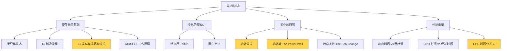
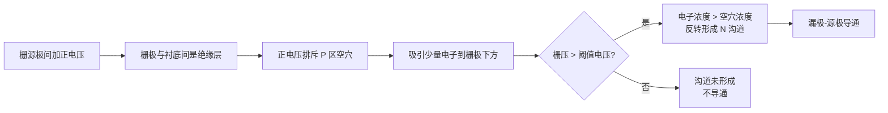
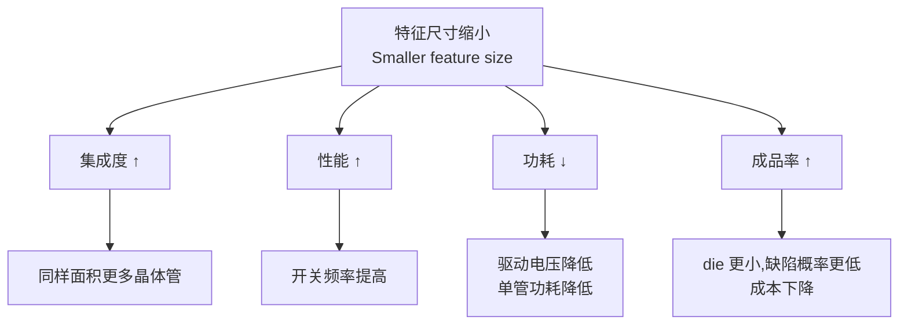
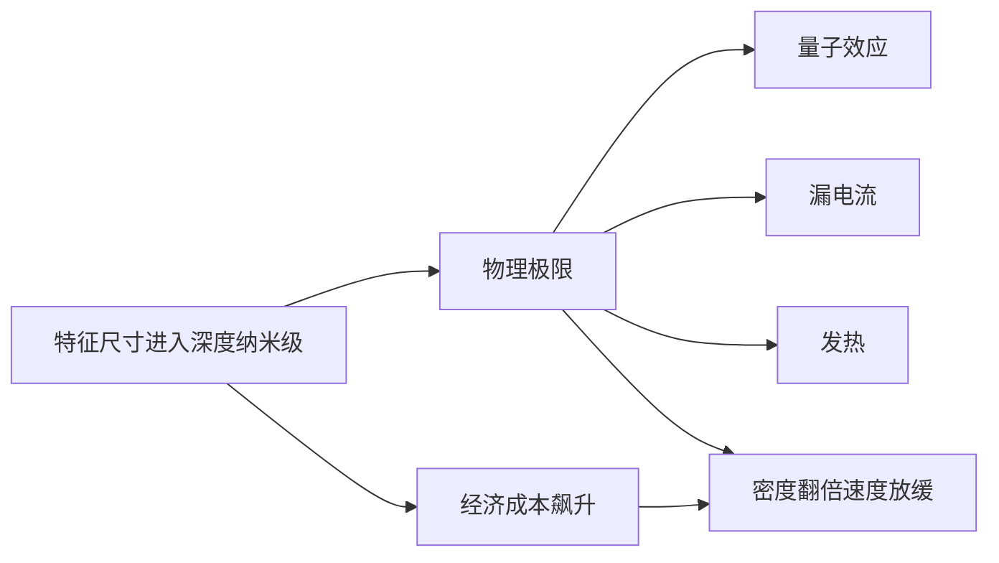
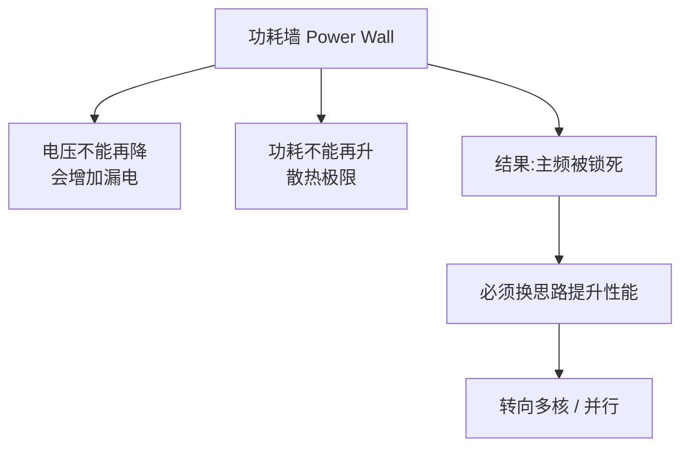
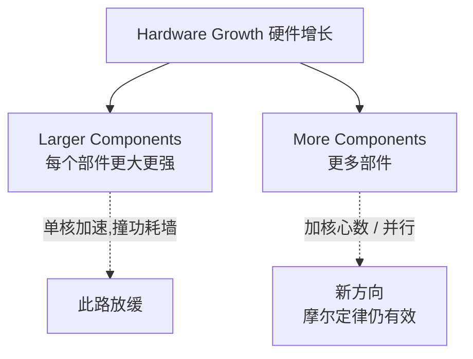
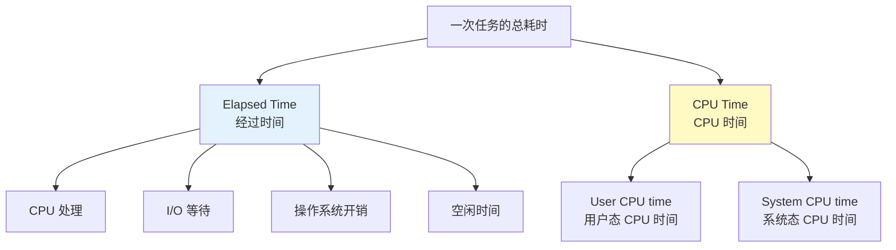
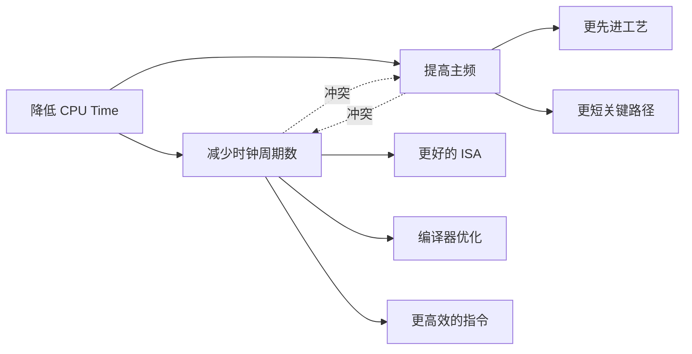

# 第 2 讲 · 半导体技术、摩尔定律、性能度量 · 复习笔记

> **一句话总览**：芯片靠**晶体管缩小**变快变便宜（摩尔定律），但**功耗墙**让单核加速失效，于是要转向多核——而要谈"快不快",必须先弄清**响应时间 / 吞吐量 / CPU 时间**这套度量体系，最后落到核心公式 **CPU 时间 = 时钟周期数 / 主频**。

## 知识地图



⭐ = 高频考点 / 计算题来源

---

## 1. 半导体技术基础

### 是什么

**半导体（Semiconductor）**：导电能力介于导体与绝缘体之间的材料，硅（Si）是最常用的。

通过**掺杂不同杂质**，可以让硅在不同区域表现为：
- **导体**（金属层，传输电流）
- **绝缘体**（隔离层，防止短路）
- **开关**（晶体管，0/1 状态）

### 为什么需要多层金属

一颗芯片上有数十亿晶体管，要把它们连起来必须用**多层金属布线**——就像多层立交，避免线路交叉短路。

---

## 2. 集成电路制造流程

### 工艺主线


### 关键术语

| 术语 | 含义 |
| --- | --- |
| Wafer（晶圆） | 圆形的硅片，一次工艺加工一整片 |
| Die（裸片） | 切下来的单个芯片 |
| Yield（成品率） | 一片晶圆上**合格 die 数 / 总 die 数** |
| Defect（缺陷） | 制造过程中产生的瑕疵 |

**例子**：一片晶圆切出 20 个 die，其中 17 个测试通过 → Yield = 17/20 = 85%

---

## 3. 集成电路成本公式 ⭐

### 三个核心公式

$$\text{Cost per die} = \frac{\text{Cost per wafer}}{\text{Dies per wafer} \times \text{Yield}}$$

$$\text{Dies per wafer} \approx \frac{\text{Wafer area}}{\text{Die area}}$$

$$\text{Yield} = \frac{1}{\left(1 + \frac{\text{Defects per area} \times \text{Die area}}{2}\right)^2}$$

### 各变量的来源（分析题常考）

| 变量 | 由谁决定 | 是否可变 |
| --- | --- | --- |
| Wafer cost | 工艺水平 | 短期固定 |
| Wafer area | 工艺设备 | 短期固定 |
| Defect rate | 制造工艺 | 工艺改进慢慢降低 |
| **Die area** | **架构和电路设计** | **设计师可控** |

### 关键洞察

**单个 die 的成本与 die 面积是非线性关系**——die 面积变大会**双重伤害**成本：

1. 一片晶圆能切的 die 数变少（线性减少）
2. 同样的缺陷密度下，每个 die 包含缺陷的概率上升 → Yield 下降（非线性减少）

所以"做小一点"对成本影响极大，这也是工业界拼命追求**特征尺寸缩小**的经济动机。

---

## 4. MOSFET 工作原理与特征尺寸

### MOSFET 是什么

**金属-氧化物-半导体场效应晶体管**——计算机里所有逻辑门的最基本开关。有三个端：**栅（Gate）、源（Source）、漏（Drain）**。

### nMOS 导通机制



**核心要点**：
- 栅极与沟道之间是**绝缘层**（氧化物），栅极不流入电流，靠**电场**控制沟道导通
- **阈值电压（Vth）** 是开关分界——电压低于 Vth 截止，高于 Vth 导通
- 这就是"晶体管 = 电压控制的开关"的物理本质

### 为什么追求小的特征尺寸（4 大动机）⭐



**四个好处一句话总结**：**集成度、性能、功耗、成品率**全方位获益。

### 缩小的几何效应

如果特征尺寸按 0.7 倍缩小（业界典型节奏）：
$$\Delta \text{Area} \approx 0.7^2 = 0.49 \approx 50\%$$

也就是说，每代工艺**面积减半，等效晶体管数翻倍**——这就是摩尔定律的物理基础。

历史数据：
- 180nm → 250nm 比值 = 0.72
- 130nm → 180nm 比值 = 0.72
- 90nm → 130nm 比值 = 0.69

---

## 5. 摩尔定律 (Moore's Law)

### 是什么

> Gordon Moore, 1965, "Cramming More Components onto Integrated Circuits"
>
> **每 18 个月，性价比合理的集成电路上的晶体管数量翻倍。**

### 为什么有效

特征尺寸每代按 0.7× 缩小 → 面积变 0.49× → 同面积塞两倍晶体管。这就把"每代翻倍"从经验观察变成了几何规律。

### 摩尔定律驱动了什么

- **微处理器性能**：1978 年到 2003 年间，单核性能年增长一度达 **52%/年**（VAX-11/780 为基准 1）
- **DRAM 容量**：1977–2012 年增长 **超过 16,000 倍**，曾经几乎每 3 年翻 4 倍（≈60%/年）

### 摩尔定律的失速



**实证数据**：台积电从 5nm 到 3nm，晶体管密度只增加 **1.6 倍**（不再是 2 倍）。

---

## 6. 功耗公式与功耗墙 ⭐

### CMOS 动态功耗（核心公式）

$$\boxed{P_{\text{dynamic}} =  C \times V^2 \times f}$$

- **C**：电容性负载（capacitive load）
- **V**：工作电压
- **f**：开关频率（switching frequency）

每次开关（0→1 或 1→0）消耗的能量：
$$E \propto C \times V^2$$

> 公式记忆：电压是**平方**，频率是**一次方**——所以**降电压比降频率更省功耗**。

### 静态功耗

晶体管即使不工作也会**漏电**。降低电压虽然省动态功耗，但会**让晶体管漏得更厉害**——这就是为什么电压不能无限降低。

### 历史趋势：性能、频率、功耗三角

```
80286 (1982) → 80486 (1989) → Pentium 4 (2004) → Core i5 (2010) → ...

功耗:    几瓦  →   十几瓦   →    100W+      →  下降到 80W左右
主频:    几MHz →   几十MHz  →    3GHz+      →   维持在 3-4GHz
```

历史上电容性负载增加约 **30 倍**，电压从 **5V 降到 1V**，频率涨了 **1000 倍**——三者综合的功耗增长被电压的平方下降部分抵消，但最终仍撞上散热墙。

### 功耗墙 (The Power Wall)

> 2005 年前后，CPU 主频停止增长，停在 3–4GHz 附近。

为什么撞墙：



### 例题：降功耗计算

> 新 CPU 的电容性负载为旧 CPU 的 85%，电压和频率各降 15%，求新功耗 / 旧功耗的比值。

$$\frac{P_{\text{new}}}{P_{\text{old}}} = \frac{C_{\text{old}} \times 0.85 \times (V_{\text{old}} \times 0.85)^2 \times F_{\text{old}} \times 0.85}{C_{\text{old}} \times V_{\text{old}}^2 \times F_{\text{old}}}$$

$$= 0.85 \times 0.85^2 \times 0.85 = 0.85^4 \approx 0.52$$

**结论**：功耗降到原来的 **52%**——但这种调参式优化已经触底了，所以才需要"转向"。

---

## 7. 转向多核 (The Sea Change)

### 单核性能停滞的根因

```
单核性能瓶颈三剑客：
  ① 功耗（Power）—— 电压不能再降
  ② 指令级并行（ILP）—— 已经挖到极限
  ③ 内存延迟（Memory latency）—— 跟不上 CPU
```

### 硬件增长的两个方向



**结论**：摩尔定律给的更多晶体管不再用来"做更复杂的单核"，而是"做更多核心"——这就是 Sea Change（大转向）。

---

## 8. 性能度量：响应时间 vs 吞吐量

### 两个根本不同的性能维度

| 维度 | 别名 | 关心什么 | 谁需要它 |
| --- | --- | --- | --- |
| **响应时间** Response time | execution time, elapsed time, latency | 单个任务多久完成 | 单用户、嵌入式关键任务 |
| **吞吐量** Throughput | bandwidth, execution rate | 单位时间完成多少任务 | 数据中心管理员 |

### 经典例子（必记）

| 飞机 | 飞行时间 | 速度 | 载客 | 吞吐量(乘客×速度) |
| --- | --- | --- | --- | --- |
| Boeing 747 | 6.5 h | 610 mph | 470 | **286,700** |
| Concorde | 3 h | 1350 mph | 132 | 178,200 |

**洞察**：
- Concorde **响应时间更短**（3h < 6.5h），单个乘客更快到
- Boeing 747 **吞吐量更高**（286,700 > 178,200），单位时间运的人更多
- **两者优化目标不同，可能完全不重合**

### 升级硬件对两者的影响

| 操作 | 响应时间 | 吞吐量 |
| --- | --- | --- |
| 用更快的处理器替换 | ↓（更快） | ↑（同时也变高） |
| **加更多处理器** | **不变**（单任务还是同一个 CPU 在跑） | **↑**（能并行处理更多任务） |

> 易错：以为"加 CPU 一定能让一个任务变快"——错。多核只对多任务有用，单线程任务在多核上不会自动变快。

---

## 9. 经过时间 vs CPU 时间

### 两种时间度量



### 区别

- **经过时间（Elapsed time）**：从开始到结束的**总挂钟时间**，包含 I/O、OS 开销、空闲。**反映系统总性能**。
- **CPU 时间**：CPU 真正花在这个任务上的时间。**剔除了 I/O 等待和别的任务占用**。包含**用户态**和**系统态**两部分。

**为什么要分开**：不同程序的瓶颈不同。
- 计算密集型程序（科学计算）→ CPU 时间是主要部分
- I/O 密集型程序（数据库查询）→ 经过时间远大于 CPU 时间

---

## 10. CPU 时钟与 CPU 时间公式 ⭐⭐

### CPU 时钟

```
   ┌─Clock period─┐
___|              |__________|              |____
   ↑               ↓
   一个时钟周期(Clock cycle)
```

| 名称 | 含义 | 例 |
| --- | --- | --- |
| **时钟周期** Clock period | 一个周期的时长 | 250 ps = 0.25 ns |
| **时钟频率** Clock rate / frequency | 每秒周期数 | 4.0 GHz = 4×10⁹ Hz |

**两者关系**：互为倒数
$$\text{Clock period} = \frac{1}{\text{Clock rate}}$$

### CPU 时间核心公式 ⭐

$$\boxed{\text{CPU Time} = \text{CPU Clock Cycles} \times \text{Clock Cycle Time} = \frac{\text{CPU Clock Cycles}}{\text{Clock Rate}}}$$

### 性能优化的两个方向

要让 CPU Time 变小，只有两条路：



### 关键权衡

**主频和周期数之间常有 trade-off**：
- 把流水线切得更深 → 每级电路更短 → 主频可以更高 → 但同一条指令要走更多级 → 周期数变多
- 简化指令使主频提高 → 但完成同样工作要更多指令 → 周期数变多

硬件设计师必须在两者之间找平衡点，这就是后续讲流水线和 RISC vs CISC 的伏笔。

---

## 期中重点速记 ⭐

按出题概率排序：

1. **CPU 时间公式**——会用 `CPU Time = Clock Cycles / Clock Rate` 算简单题
2. **CMOS 动态功耗公式** P ∝ C·V²·f，**电压是平方的**（必考）
3. **降功耗例题套路**——给百分比变化求新旧比值，关键是 V 项要平方
4. **响应时间 vs 吞吐量**——例子（Boeing vs Concorde）+ 区别 + 哪种场景关心哪个
5. **CPU 时间 vs 经过时间**——区别 + 各自包含什么
6. **小特征尺寸的 4 个好处**——集成度、性能、功耗、成品率
7. **IC 成本与 Yield 公式**——可能出选择题或简单计算
8. **摩尔定律的内容**——18 个月翻倍 + 几何依据（0.7² ≈ 0.5）
9. **功耗墙的成因**——电压降不下去 + 散热限制 → 转向多核
10. **MOSFET 导通条件**——栅压 > 阈值电压形成沟道

---

## 易错点汇总

- ❌ 把功耗公式写成 P ∝ C·V·f（漏掉平方）→ ✅ **V 是平方**
- ❌ 以为"加更多 CPU 单任务会变快"→ ✅ 多核只提升吞吐量，单线程响应时间不变
- ❌ 把经过时间和 CPU 时间混用 → ✅ 经过时间含 I/O 和等待，CPU 时间不含
- ❌ 把 Yield 当成"所有 die 中合格的比例"，忽略 die 面积影响 → ✅ Yield 公式里 Die area 在分母平方位置，面积越大 Yield 越低
- ❌ 认为摩尔定律说的是"性能"翻倍 → ✅ 原版说的是**晶体管数量**翻倍，性能翻倍是间接结果
- ❌ "MOSFET 栅极有电流流入控制开关" → ✅ 栅极**绝缘**，靠**电场**控制；流入电流的是漏-源沟道
- ❌ 单核停止变快是因为摩尔定律失效 → ✅ 摩尔定律（晶体管密度）还在，是**功耗墙**让"用更多晶体管做更复杂单核"不划算了

---

## 自测题

### 一、选择题

**1. 下列关于 MOSFET 的说法，正确的是：**

A. 栅极与沟道导通，靠栅极电流控制漏极电流
B. 栅极与沟道之间是绝缘层，靠电场反转沟道形成导电
C. 只要在栅极加正电压，nMOS 就会导通
D. 阈值电压越高的 MOSFET 越省电

<details>
<summary>答案与解析</summary>

**答案：B**

- A 错：栅极有绝缘层，**没有电流**流入栅极，靠电场（电压建立的电场）控制沟道。
- B 对：这就是 MOSFET 的核心机制——电压在 P 区表面感应出电子，超过阈值后形成 N 沟道。
- C 错：必须**栅压 > 阈值电压 Vth** 才导通。低于阈值时沟道未形成。
- D 错：阈值电压高低与省电没有直接因果关系。降低工作电压（V）才省功耗（P ∝ V²），不是降阈值电压。

</details>

**2. 关于摩尔定律，下列说法错误的是：**

A. 1965 年由 Gordon Moore 提出
B. 内容是"性价比合理的集成电路上晶体管数量约每 18 个月翻倍"
C. 摩尔定律说的是 CPU 性能每 18 个月翻倍
D. 近年因为物理极限和成本，密度翻倍的速度已显著放缓

<details>
<summary>答案与解析</summary>

**答案：C**

- A、B、D 都对。
- C 错：摩尔定律说的是**晶体管数量**翻倍，**不是性能**。性能提升是晶体管增多 + 工艺改进的间接结果，且历史上各时期增速不同（曾达 52%/年，后降到 22%/年）。把"晶体管"和"性能"画等号是常见错误。

</details>

**3. 关于响应时间和吞吐量，下列哪个组合是对的？**

A. 数据中心管理员关心响应时间；嵌入式系统关心吞吐量
B. 加更多 CPU，单任务响应时间会变短
C. Concorde 比 Boeing 747 响应时间短，但吞吐量低
D. 响应时间和吞吐量是同一个指标的两种叫法

<details>
<summary>答案与解析</summary>

**答案：C**

- A 错：刚好反了——**数据中心**关心吞吐量（多任务），**嵌入式关键任务**关心响应时间（单任务延迟）。
- B 错：加 CPU 不会让**单线程任务**变快。多核提升的是吞吐量。
- C 对：Concorde 飞 3h（响应时间短），但只载 132 人，吞吐量 178,200，低于 Boeing 747 的 286,700。
- D 错：两者是不同维度——前者按"任务时长"量，后者按"单位时间任务数"量。

</details>

**4. CPU 时间和经过时间（Elapsed time）的关系是：**

A. CPU 时间总是等于经过时间
B. 经过时间 = CPU 时间 + I/O 等待 + OS 开销 + 空闲时间等
C. 对于 I/O 密集型程序，CPU 时间通常大于经过时间
D. CPU 时间不区分用户态和系统态

<details>
<summary>答案与解析</summary>

**答案：B**

- A 错：只有在没有任何 I/O 和等待的纯计算任务里两者才相近。
- B 对：经过时间是挂钟时间，包含一切；CPU 时间只算 CPU 真正在执行任务的部分。
- C 错：反了。I/O 密集型程序的经过时间**远大于** CPU 时间（大量时间在等磁盘 / 网络）。
- D 错：CPU 时间分为 **user CPU time** 和 **system CPU time** 两部分。

</details>

**5. 下列关于 IC 成本的说法，正确的是：**

A. Die 面积加倍，每个 die 的成本也只是加倍
B. Die 面积越小，Yield 越高，单个 die 成本越低
C. Wafer 的成本主要由 die 面积决定
D. Yield 与缺陷密度无关

<details>
<summary>答案与解析</summary>

**答案：B**

- A 错：Die 面积加倍会**双重打击**成本——一片 wafer 切的 die 数减半（线性），同时 Yield 因为缺陷概率上升而下降（非线性）。综合起来成本远超 2 倍。
- B 对：所以业界拼命缩小 die size。
- C 错：Wafer 成本由**工艺水平**决定，wafer 面积也是固定的。
- D 错：Yield 公式里 `Defects per area` 直接出现在分母里。

</details>

### 二、简答题

**1. 为什么追求更小的特征尺寸？请列出至少 4 个理由。**

<details>
<summary>参考答案</summary>

四个核心理由（PPT 原话：集成度、性能、功耗、成品率）：

1. **集成度提升**：同样面积可以塞更多晶体管（面积按 0.7² ≈ 0.5 倍缩小，密度翻倍），这是摩尔定律的物理基础。
2. **性能提升**：晶体管更小 → 开关频率更高 → 主频更高。
3. **功耗降低**：晶体管尺寸小允许工作电压降低，而功耗 P ∝ V²，所以电压降一点功耗降很多。
4. **成品率（Yield）提升**：单个 die 面积小，包含缺陷的概率低，Yield 更高，单 die 生产成本更低。

</details>

**2. 什么是"功耗墙"（The Power Wall）？为什么会撞上？**

<details>
<summary>参考答案</summary>

**功耗墙**：约 2005 年起，CPU 主频无法继续提升的现象（卡在 3–4 GHz）。

撞墙的两个根本原因：

1. **电压不能再降**：动态功耗 P ∝ V²，降压本是有效手段；但电压降低后晶体管**漏电（静态功耗）**显著增加，总功耗反而上升。
2. **散热达到上限**：单芯片功耗超过 100W 后，无法用普通方式散热；继续提升频率会过热烧毁。

后果：单核加速失效，业界**转向多核（Sea Change）**——靠"更多核心"而非"更快单核"提升性能。

</details>

**3. 简述 CPU 时间公式，并说明硬件设计者通常需要权衡什么？**

<details>
<summary>参考答案</summary>

**公式**：

$$\text{CPU Time} = \text{CPU Clock Cycles} \times \text{Clock Cycle Time} = \frac{\text{CPU Clock Cycles}}{\text{Clock Rate}}$$

**两条优化路径**：
- 减少时钟周期数（更好的 ISA、更高效的指令、编译器优化）
- 提高主频

**权衡冲突**：两条路径常常相互冲突。例如：
- 把流水线切得更深 → 每级电路更短 → 主频可提高 → 但每条指令要经过更多级 → 周期数增加
- 简化指令使主频提高 → 但完成同样工作所需指令更多 → 周期数增加

设计者必须在两者间找平衡点。

</details>

### 三、计算题

**1. 一片晶圆切出 25 个 die，其中 22 个测试合格。求 Yield。**

<details>
<summary>解答过程</summary>

$$\text{Yield} = \frac{\text{合格 die 数}}{\text{总 die 数}} = \frac{22}{25} = 0.88 = 88\%$$

（注：这里用 Yield 的实测定义，不是公式估算）

</details>

**2. 假设新 CPU 相比旧 CPU：**
- **电容性负载减少 10%**（C_new = 0.9 × C_old）
- **电压降低 20%**（V_new = 0.8 × V_old）
- **频率降低 10%**（F_new = 0.9 × F_old）

**求新 CPU 功耗占旧 CPU 功耗的百分比。**

<details>
<summary>解答过程</summary>

**公式**：$P = C \times V^2 \times F$

**比值**：
$$\frac{P_{\text{new}}}{P_{\text{old}}} = \frac{C_{\text{old}} \times 0.9 \times (V_{\text{old}} \times 0.8)^2 \times F_{\text{old}} \times 0.9}{C_{\text{old}} \times V_{\text{old}}^2 \times F_{\text{old}}}$$

$$= 0.9 \times 0.8^2 \times 0.9 = 0.9 \times 0.64 \times 0.9$$

$$= 0.5184 \approx 51.8\%$$

**结论**：新 CPU 功耗约为旧 CPU 的 **51.8%**。

**关键点**：电压项要**平方**——这是降功耗最有效的杠杆，最容易丢分的也是这里。

</details>

**3. 某 CPU 主频 2.5 GHz，运行某程序需要 5 × 10⁹ 个时钟周期。求该程序的 CPU 时间。**

<details>
<summary>解答过程</summary>

**公式**：
$$\text{CPU Time} = \frac{\text{CPU Clock Cycles}}{\text{Clock Rate}}$$

**代入**：
$$\text{CPU Time} = \frac{5 \times 10^9}{2.5 \times 10^9 \text{ Hz}} = 2 \text{ s}$$

**结论**：CPU 时间为 **2 秒**。

</details>

**4. 假设某代工艺特征尺寸从 14nm 缩小到 10nm，按几何关系估算芯片面积变为原来的多少？**

<details>
<summary>解答过程</summary>

**思路**：面积是尺寸的平方。

**比值**：
$$\frac{S_{\text{new}}}{S_{\text{old}}} = \left(\frac{10}{14}\right)^2 = \left(\frac{5}{7}\right)^2 \approx 0.714^2 \approx 0.51$$

**结论**：面积约缩小到原来的 **51%**——也就是同面积可以塞约 **2 倍**的晶体管，符合摩尔定律预期。

</details>
