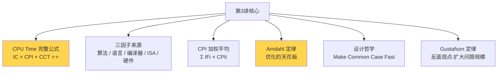
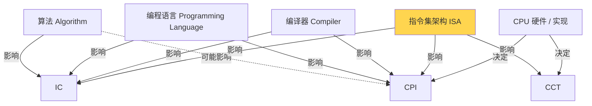
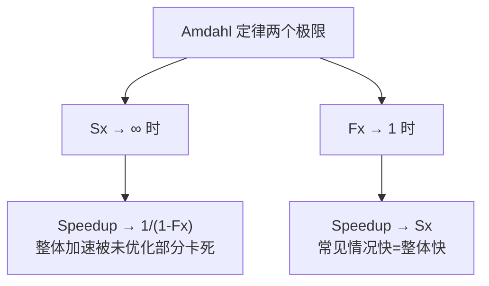
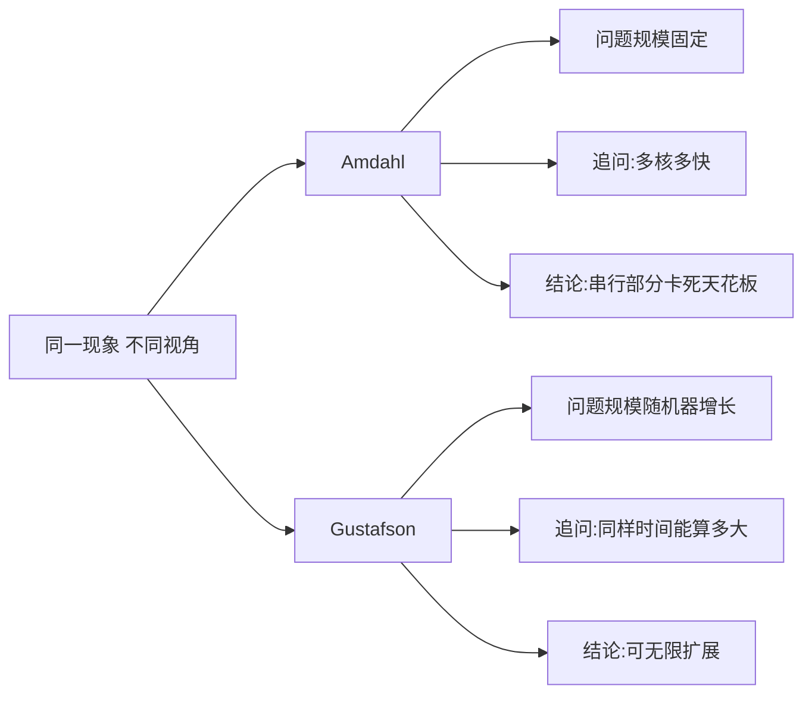

# 第 3 讲 · CPU 性能公式 + Amdahl/Gustafson 定律 · 复习笔记

> **一句话总览**：CPU Time 不只是"周期数 / 主频",还能进一步拆成 **指令数 × CPI × 周期时间**——这三个因子由不同环节决定（算法/编译器/硬件），而**优化的天花板**由 Amdahl 定律给出："优化不常见的部分,收益封顶"。要突破这个天花板,Gustafson 给出另一条路:不优化老问题,而是**用同样时间做更大的问题**。

## 知识地图



⭐ = 核心考点 / 高频计算题来源

---

## 1. 衔接复习:CPU Time 基础公式（lec2 内容）

### 核心公式（必背）

$$\text{CPU Time} = \text{CPU Clock Cycles} \times \text{Clock Cycle Time} = \frac{\text{CPU Clock Cycles}}{\text{Clock Rate}}$$

### 例题:计算机 B 需要多快的主频

> 计算机 A:2 GHz 主频, CPU Time = 10 s
> 设计计算机 B:目标 CPU Time = 6 s, 但实现会让时钟周期数变为 1.2 倍
> 问 B 的主频应该多少?

**第一步:求 A 的总周期数**
$$\text{Cycles}_A = \text{CPU Time}_A \times \text{Rate}_A = 10\text{s} \times 2\text{GHz} = 20 \times 10^9$$

**第二步:求 B 的总周期数**
$$\text{Cycles}_B = 1.2 \times \text{Cycles}_A = 24 \times 10^9$$

**第三步:由 B 的目标时间求主频**
$$\text{Rate}_B = \frac{\text{Cycles}_B}{\text{CPU Time}_B} = \frac{24 \times 10^9}{6\text{s}} = 4\text{ GHz}$$

**关键洞察**:升主频和降周期数常常**互相冲突**——这道题就是体现"为提速 1.67× 付出主频翻倍"的代价。

---

## 2. 核心公式:CPU Time 的三因子分解 ⭐⭐

### 是什么

时钟周期数 = 指令数 × 平均每条指令的周期数,因此:

$$\boxed{\text{CPU Time} = \text{IC} \times \text{CPI} \times \text{CCT} = \frac{\text{IC} \times \text{CPI}}{\text{Clock Rate}}}$$

| 缩写 | 全称 | 含义 |
| --- | --- | --- |
| **IC** | Instruction Count | 程序总共执行了多少条指令 |
| **CPI** | Cycles Per Instruction | 平均每条指令花多少个时钟周期 |
| **CCT** | Clock Cycle Time | 一个时钟周期多长（= 1 / Clock Rate） |

### The BIG Picture(综合性能公式)

把 CPU Time 写成三个分数的乘积,每个分数代表一个层次:

$$\text{CPU Time} = \frac{\text{Instructions}}{\text{Program}} \times \frac{\text{Clock cycles}}{\text{Instruction}} \times \frac{\text{Seconds}}{\text{Clock cycle}}$$

读法:
- 第一项 IC——程序需要多少条指令
- 第二项 CPI——每条指令需要多少周期  
- 第三项 CCT——每个周期多少秒

三者相乘,单位相消,正好是"秒/程序"。

---

## 3. 三因子由谁决定 ⭐

这是简答题高频考点——能区分各个层次的影响。



### 详解

| 因子 | 谁决定 | 关键洞察 |
| --- | --- | --- |
| **IC** | 程序、ISA、编译器 | 同一算法用不同 ISA / 编译器, IC 可能差很多。CISC 通常 IC 小,RISC 通常 IC 大 |
| **CPI** | CPU 硬件实现 + 指令组合 | 即使 ISA 相同,流水线 / Cache 设计不同, CPI 可能差很多 |
| **CCT** | CPU 硬件 / 工艺 | 由关键路径决定 |

**特别关注 ISA**:它**同时影响三个因子**——这就是为什么 ISA 设计如此关键。

### 一个常见的错误推理

> ❌ "B 的 CPI 比 A 低,所以 B 更快"

**只在 IC 和 CCT 都相同时才成立**。比如 RISC-V 比某条 CISC 指令的 CPI 低,但 RISC-V 完成同一任务可能需要更多指令,IC 更大,总时间反而可能更长。**只有完整 CPU Time 才是最终评判标准**。

---

## 4. CPI 的细化:指令分类与加权平均 ⭐

### 为什么需要细化

不同指令的 CPI 不同——加法可能 1 周期,乘法 4 周期,内存访问 5 周期。"平均 CPI"只在固定指令组合下有意义。

### 加权平均公式

如果指令分 n 类,第 i 类:
- 数量 ICᵢ,CPI 为 CPIᵢ
- **指令频率（Instruction Frequency）** IFᵢ = ICᵢ / IC

则:

$$\text{Total Clock Cycles} = \sum_{i=1}^{n} (\text{CPI}_i \times \text{IC}_i)$$

$$\boxed{\overline{\text{CPI}} = \frac{\text{Total Clock Cycles}}{\text{IC}} = \sum_{i=1}^{n} (\text{IF}_i \times \text{CPI}_i)}$$

### 例题 1:同 ISA 下的两份编译代码

某 ISA 有 A、B、C 三类指令,CPI 分别为 1、2、3。两份编译序列:

| 指令类 | A | B | C | 序列 1 IC | 序列 2 IC |
| --- | --- | --- | --- | --- | --- |
| **CPI** | 1 | 2 | 3 | – | – |
| 序列 1 各类指令数 | 2 | 1 | 2 | **5** | – |
| 序列 2 各类指令数 | 4 | 1 | 1 | – | **6** |

**序列 1**:
$$\text{Cycles}_1 = 2 \times 1 + 1 \times 2 + 2 \times 3 = 10, \quad \overline{\text{CPI}}_1 = 10/5 = 2.0$$

**序列 2**:
$$\text{Cycles}_2 = 4 \times 1 + 1 \times 2 + 1 \times 3 = 9, \quad \overline{\text{CPI}}_2 = 9/6 = 1.5$$

**关键洞察**:序列 2 指令更多（IC=6 > 5）,但**总周期数反而更少**（9 < 10）——因为 CPI 低的简单指令占比高。

> 这个例子说明:**IC 大 ≠ 慢**, **CPI 高 ≠ 慢**, 只有 **IC × CPI**（即总周期数）才决定速度。

### 例题 2:平均指令执行时间

简单非流水线处理器, CCT = 2 ns:

| 操作 | IFᵢ | CPIᵢ | IFᵢ × CPIᵢ | (% 占用时间) |
| --- | --- | --- | --- | --- |
| ALU | 0.5 | 4 | 2.0 | 46% |
| Load | 0.2 | 5 | 1.0 | 23% |
| Store | 0.1 | 5 | 0.5 | 12% |
| Branch | 0.2 | 4 | 0.8 | 19% |
| **合计** | 1.0 | – | **4.3** | 100% |

$$\overline{\text{CPI}} = \sum(IF_i \times CPI_i) = 4.3$$

$$\text{平均指令执行时间} = \overline{\text{CPI}} \times \text{CCT} = 4.3 \times 2\text{ns} = 8.6\text{ns}$$

### 重要注解

- **频率高的指令贡献更大**:ALU 虽然 CPI 不算最高,但因为 IF=0.5,占总时间 46%
- **CPI 应该实测**,不能只查指令手册——要包含流水线和内存效应（cache miss、分支预测错误等）
- **CPI（或 IPC）作比较只在 IC 和 CCT 相同时才公平**

---

## 5. CPU Time 比较例题

> 计算机 A:CCT = 250 ps, CPI = 2.0
> 计算机 B:CCT = 500 ps, CPI = 1.2
> 同一 ISA(意味着同一程序的 IC 相同), 哪个更快?快多少?

设两机的 IC 都是 I:

$$\text{CPU Time}_A = I \times 2.0 \times 250\text{ps} = I \times 500\text{ps}$$

$$\text{CPU Time}_B = I \times 1.2 \times 500\text{ps} = I \times 600\text{ps}$$

$$\frac{\text{CPU Time}_B}{\text{CPU Time}_A} = \frac{600}{500} = 1.2$$

**结论**:**A 更快**,B 比 A 慢 1.2 倍 / A 比 B 快 1.2 倍。

**关键**:虽然 B 的 CPI 更低（1.2 < 2.0）,但 B 的周期更长（500 > 250 ps）,综合下来反而慢——再次印证"只看一个因子下结论是错的"。

---

## 6. Amdahl 定律 ⭐⭐

### 是什么

> **优化系统的某一部分,整体加速比有上限。** 上限由"未优化部分占多少"决定。

这是计算机性能优化的**第一原理**——它告诉你优化的边界在哪。

### 公式

设原系统中:
- **Fx** = 被优化部分占原始执行时间的比例
- **Sx** = 该部分的提速倍数

则**整体加速比**:

$$\boxed{\text{Speedup} = \frac{1}{(1 - F_x) + \dfrac{F_x}{S_x}}}$$

### 公式来源(直观推导)

把执行时间分成两部分:被影响的 + 未被影响的。

```
原始时间 T = T_affected + T_unaffected = Fx · T + (1-Fx) · T

优化后时间 T' = (Fx · T) / Sx + (1 - Fx) · T

speedup = T / T' = 1 / ((1-Fx) + Fx/Sx)
```

### 例题 1:浮点优化的加速

> 把浮点指令模块加速 2×, 但程序里只有 20% 是浮点指令,整体加速多少?

代入 Fx = 0.2, Sx = 2:

$$\text{Speedup} = \frac{1}{(1 - 0.2) + \frac{0.2}{2}} = \frac{1}{0.8 + 0.1} = \frac{1}{0.9} \approx 1.111$$

**只有 11.1% 的提速**——花大力气换来的回报很有限,因为 80% 的时间根本没被优化。

### 例题 2:乘法占 80%,要 5× 整体加速

> 乘法占 80 秒 / 100 秒,需要把乘法加速多少倍才能整体 5×?

设乘法加速 n 倍,总时间 = 80/n + 20

要 5× 整体加速,需总时间 = 20s:
$$20 = \frac{80}{n} + 20 \implies \frac{80}{n} = 0 \implies n = \infty$$

**无解!** 即使乘法无限加速,极限也只能省掉那 80 秒,剩下 20 秒不能动。

最大整体加速 = 100/20 = **5×**——所以"刚好 5×"无法用有限提速达到。

### Amdahl 定律的两个极限



#### 极限 1:Sx → ∞(无限加速被优化的部分)

$$\lim_{S_x \to \infty} \text{Speedup} = \frac{1}{1 - F_x}$$

意义:**无论多努力,加速天花板由"没被优化的部分"决定**。
- Fx = 0.5 → 上限 2×
- Fx = 0.8 → 上限 5× (上面那道题)
- Fx = 0.9 → 上限 10×
- Fx = 0.99 → 上限 100×

#### 极限 2:Fx → 1(几乎所有时间都在优化范围内)

$$\lim_{F_x \to 1} \text{Speedup} = S_x$$

意义:**让常见情况变快, 整体就和它一样快**。这就是著名的 **"Make the Common Case Fast"**。

### 收益递减(Diminishing Returns)

固定 Fx, 增大 Sx, speedup 增长越来越慢——一旦 Fx/Sx 比 (1-Fx) 小很多,继续投入提升 Sx 的"性价比"急速下降。

**实际启示**:与其把已经快的部分做得更快,不如想办法**扩大被优化部分的覆盖范围**(增大 Fx)。

### 并行化的特例

并行计算是 Amdahl 定律的特例。设:
- F = 可并行的部分占比
- N = 处理器数

$$\text{Speedup} = \frac{1}{(1 - F) + \dfrac{F}{N}}$$

**洞察**:即使有无限多核, 上限是 1/(1-F)。比如 F=90%, 上限 10×, **再多核也没用**。
**并行计算的关键不是"加更多核",而是"让 F 更接近 1"**。

---

## 7. 设计哲学:"Make the Common Case Fast" ⭐

### 是什么

计算机设计**最重要、最普遍、最简单**的原则。它直接来自 Amdahl 定律:Fx 越大,优化收益越大 → 优先优化"频繁出现的情况"。

### 三种应用场景

| 场景 | 具体做法 |
| --- | --- |
| **设计权衡** | 在多个设计方案中, 优先满足常见情况的需求, 而非罕见情况 |
| **资源分配** | 把硬件资源(晶体管、Cache 容量、寄存器数量)倾斜给频繁事件 |
| **模块优化** | 优化一个模块时, 瞄准其平均行为, 不为极端情况过度设计 |

### 附加好处

**常见情况通常更简单**——优化常见情况不仅收益大, 实现难度也低。例:CPU 流水线主要为"无 Hazard 的连续指令"优化, 异常分支走慢路径。

### 实施需回答的两个问题

1. **如何判断常见情况是哪个?**——靠 profiling(性能剖析), 实测各类指令 / 操作的占比
2. **优化它能带来多少收益?**——用 Amdahl 公式估算, 避免过度投入

---

## 8. Gustafson 定律(Amdahl 的"反面")

### 是什么

> Amdahl 假设**问题规模固定**, 算同一道题怎么变快;
>
> Gustafson 认为, **问题规模会随机器规模一起增长**——并行机器更多, 我们不是更快地解决老问题, 而是**用同样时间解决更大的问题**。

### 推导

设:
- a = 串行部分的延迟
- b = 并行部分的延迟(单核执行时)
- F = a/(a+b) 是**串行部分占总时间的比例**

n 个处理器时, 加速比:

$$S = \frac{a + n \cdot b}{a + b} = \frac{a}{a+b} + n \cdot \frac{b}{a+b} = F + n(1 - F) = n - F(n-1)$$

### 关键差异:F 的含义不同(必看, 易混)

| 公式 | F 的含义 |
| --- | --- |
| **Amdahl** | F 是**可优化/可并行**部分的占比 |
| **Gustafson(本课公式)** | F 是**串行**部分的占比, 即 1 - 可并行占比 |

> 看公式时一定要先确定 F 的定义, 否则结论会反过来。

### 验证特殊情形

- n = 1(单核):S = 1 - F·0 = **1** ✓
- F = 0(全可并行):S = n ✓ (完美线性加速)
- F = 1(全串行):S = n - (n-1) = **1** ✓ (并行没用)

### Gustafson 的乐观结论

只要**问题可以无限放大**, 就总能高效利用更多核心——大数据、大规模仿真、深度学习训练就是典型例子。问题规模越大, 串行部分的相对占比越低, 并行加速越接近线性。

---

## 9. Amdahl vs Gustafson 对比 ⭐



### 核心对比表

| 维度 | Amdahl 定律 | Gustafson 定律 |
| --- | --- | --- |
| **隐含假设** | 问题规模**固定** | 问题规模**随并行度增长** |
| **关心问题** | 多核能让现有任务**多快**? | 同样时间能解决**多大**问题? |
| **加速极限** | 1/(1-F),有限 | 接近 N(线性) |
| **悲观/乐观** | 悲观 | 乐观 |
| **典型场景** | 实时系统、嵌入式、单一任务延迟敏感 | 大数据、HPC、模拟、训练 |
| **F 含义** | 可并行/可优化部分占比 | **串行**部分占比 |

### 哪个对?

**两个都对——只是回答了不同的问题。**

固定问题情境下,Amdahl 给出残酷的天花板;扩展问题情境下,Gustafson 给出乐观的展望。**实际工程中两者经常并存**:有些任务是固定规模的(响应时间敏感的事务),有些可随机器扩展(大数据分析)。

---

## 10. 第 1 章总结要点

PPT 最后总结的 6 条:

1. **成本/性能持续提升**, 来自底层技术(工艺、材料)进步
2. **抽象的层次结构**贯穿软硬件
3. **ISA 是软硬件接口**
4. **执行时间是衡量性能的最佳指标**——别被主频、IPC 之类单一数字误导
5. **功耗是限制因素**(power wall, lec2 内容)
6. **用并行提升性能**是当前主流方向

---

## 期中重点速记 ⭐

按概率排序:

1. **CPU Time = IC × CPI × CCT** —— 必背
2. **CPI 加权平均公式** Σ(IFᵢ × CPIᵢ) —— 计算题必考
3. **Amdahl 公式** 1 / ((1-Fx) + Fx/Sx) —— 计算题必考
4. **Amdahl 极限** 1/(1-Fx) —— 简答题考点
5. **三因子由谁决定**(算法/语言/编译器/ISA/硬件) —— 简答题考点
6. **Make the Common Case Fast** —— 设计哲学,可作论述题
7. **Gustafson 公式** F + n(1-F) 及与 Amdahl 的差异 —— 区分题
8. **CPU Time 比较例题套路** —— 设两机 IC 相同, 算总时间比

---

## 易错点汇总

- ❌ 只看 CPI 比较两个 CPU 的快慢 → ✅ 必须 IC、CPI、CCT 都看(等价于看总 CPU Time)
- ❌ 加权 CPI 用算术平均(直接平均各类 CPI) → ✅ 用频率加权 Σ(IFᵢ × CPIᵢ)
- ❌ Amdahl 中 Fx 写成"未优化部分" → ✅ Fx 是**被优化**部分占比, (1-Fx) 才是未优化
- ❌ 把并行的 N 越大, 加速比也无限增大 → ✅ 受限于 1/(1-F),F 是串行/不可并行部分
- ❌ 把 Amdahl 和 Gustafson 中的 F 当成同一个量 → ✅ Amdahl 的 F 是"可优化", Gustafson 的 F 是"串行", 互为补集
- ❌ 用查手册的 CPI 估算性能 → ✅ 实测, 因为要包含 cache miss 和分支预测错误的影响
- ❌ 套 Amdahl 时漏掉"5× 不可达"的判断 → ✅ 整体加速 ≥ 1/(1-Fx) 时无解

---

## 自测题

### 一、选择题

**1. 下列关于 CPU Time = IC × CPI × CCT 的说法,正确的是:**

A. IC、CPI、CCT 三者完全独立,优化任何一项都能提升整体性能
B. 只有当 IC 和 CCT 相同时, 才能用 CPI 比较两台 CPU 的快慢
C. CPI 由编译器决定, 与 CPU 硬件无关
D. ISA 只影响 IC, 不影响 CPI 和 CCT

<details>
<summary>答案与解析</summary>

**答案:B**

- A 错:三者经常**互相牵制**——主频提高(CCT 减小)往往让流水线变深, CPI 上升;ISA 简化让 CPI 下降, 但 IC 上升。
- B 对:CPI(或 IPC)只能在 IC 和 CCT 相同的前提下作公平比较, 否则结论可能反过来(本讲例题就是 B 的 CPI 更低却更慢)。
- C 错:CPI 主要由 **CPU 硬件实现** 决定(流水线、Cache 等), 编译器只影响指令组合从而间接影响平均 CPI。
- D 错:ISA **同时影响 IC、CPI、CCT 三个**——这正是 ISA 设计如此关键的原因。

</details>

**2. Amdahl 定律告诉我们,如果某项优化只影响程序 30% 的执行时间, 把这部分加速 100 倍, 整体加速比最大约为:**

A. 100 倍
B. 30 倍
C. 1.43 倍
D. 3.33 倍

<details>
<summary>答案与解析</summary>

**答案:C**

代入 Fx = 0.3, Sx = 100:
$$\text{Speedup} = \frac{1}{(1-0.3) + \frac{0.3}{100}} = \frac{1}{0.7 + 0.003} = \frac{1}{0.703} \approx 1.42$$

- A 错:把局部加速比误当作整体加速比。
- B 错:不知所云。
- D 错:这是上限 1/(1-Fx) = 1/0.7 ≈ 1.43, 但实际值由于 Fx/Sx = 0.003 还差一点,只能 1.42。**用 Sx=100 已经非常接近上限了。**

**重要启示**:即使把这 30% 的部分加速到无限快, 整体也只能 ≈ 1.43 倍。优化"占比小的部分"投入产出比极差。

</details>

**3. 下列关于 Amdahl 定律和 Gustafson 定律的说法, 正确的是:**

A. 两个定律本质矛盾, 只能信一个
B. Amdahl 假设问题规模随核心数增长, Gustafson 假设规模固定
C. Gustafson 定律说明:只要可以扩大问题规模, 增加更多处理器仍能获得近线性加速
D. 在 Amdahl 公式 1/((1-F)+F/N) 中, F 是串行部分占比

<details>
<summary>答案与解析</summary>

**答案:C**

- A 错:两者**回答的不是同一个问题**——Amdahl 在固定问题, Gustafson 在变化问题。两者都是对的, 只是适用场景不同。
- B 错:刚好反了。**Amdahl 假设固定**, **Gustafson 假设规模随机器增长**。
- C 对:这就是 Gustafson 的乐观结论, 也是大数据、HPC 时代为什么不用怕"Amdahl 天花板"。
- D 错:Amdahl 公式里 F 是**可并行/可优化**部分占比, **(1-F) 才是串行**。本课讲的 Gustafson 公式里 F 才是串行部分占比。**两个 F 含义相反, 必区分。**

</details>

**4. 关于 "Make the Common Case Fast" 原则, 下列哪项不是它的直接体现?**

A. CPU 给频繁使用的算术运算分配更多硬件资源
B. Cache 设计针对程序的局部性优化命中率
C. 异常处理走慢路径, 正常分支走快路径
D. 给所有指令分配相同的执行时间以简化设计

<details>
<summary>答案与解析</summary>

**答案:D**

- A、B、C 都是经典的"常见情况快"应用——把资源、流水线、关键路径让给频繁的情况。
- D 错:让所有指令"一刀切"等长执行, 等同于把简单指令拖慢以匹配复杂指令——是"反"该原则的做法。RISC 设计反倒会让常见简单指令尽可能 1 周期完成, 复杂操作分解成多条简单指令。

</details>

**5. 已知一段程序在某 CPU 上 IC=2×10⁸, 平均 CPI=3, 主频 2GHz, 则 CPU Time 为:**

A. 0.075 s
B. 0.3 s
C. 0.15 s
D. 1.5 s

<details>
<summary>答案与解析</summary>

**答案:B**

$$\text{CPU Time} = \frac{\text{IC} \times \text{CPI}}{\text{Clock Rate}} = \frac{2 \times 10^8 \times 3}{2 \times 10^9} = \frac{6 \times 10^8}{2 \times 10^9} = 0.3\text{s}$$

- A 错:漏乘 IC 数(只算了 CPI/Rate)。
- C 错:可能是把 CPI 写成 1.5 误算。
- D 错:量级判断错。

**速算技巧**:总周期数 = IC × CPI = 6×10⁸, 主频 2×10⁹/s, 直接除即可。

</details>

### 二、简答题

**1. 影响 CPU 性能(CPU Time)的因素有哪些? 各因素分别影响 IC、CPI、CCT 中的哪些?**

<details>
<summary>参考答案</summary>

CPU Time = IC × CPI × CCT, 各因素的影响:

1. **算法(Algorithm)**:主要影响 **IC**(选择什么算法决定要执行多少操作), 也可能影响 **CPI**(不同算法用到的指令组合不同)
2. **编程语言(Programming Language)**:影响 **IC** 和 **CPI**(同一逻辑用不同语言编出来的指令数和组合不同, 如 C 比 Python 通常 IC 更小)
3. **编译器(Compiler)**:影响 **IC** 和 **CPI**(优化器会减少冗余指令, 选用更高效的指令)
4. **指令集架构(ISA)**:**同时影响 IC、CPI、CCT 三者**——这是 ISA 关键性的体现
5. **CPU 硬件实现**:决定 **CPI 和 CCT**(流水线深度、Cache、分支预测都直接影响 CPI;关键路径长度决定 CCT)

记忆顺口溜:**算法→IC, 编译/语言→IC+CPI, ISA→全部, 硬件→CPI+CCT**。

</details>

**2. 简述 Amdahl 定律的内容、公式, 并说明它的核心启示。**

<details>
<summary>参考答案</summary>

**内容**:对系统某一部分进行优化, 整体性能的提升受未优化部分的限制。

**公式**:
$$\text{Speedup} = \frac{1}{(1-F_x) + F_x/S_x}$$
其中 Fx 是被优化部分占原始执行时间的比例, Sx 是该部分的提速倍数。

**核心启示(三条)**:

1. **整体加速有天花板**:Sx → ∞ 时, 加速比上限为 1/(1-Fx), 由不可优化部分卡死。
2. **优化要瞄准频繁部分(Make the Common Case Fast)**:Fx 越大, 优化的整体回报越大;反之, 优化占比小的部分回报极差。
3. **收益递减(Diminishing Returns)**:同一个 Fx 下, 单纯增大 Sx 的回报会越来越小, 一旦 Fx/Sx 远小于 (1-Fx), 继续投入性价比急速下降。

</details>

**3. Amdahl 定律和 Gustafson 定律有什么本质区别? 各适用什么场景?**

<details>
<summary>参考答案</summary>

**本质区别**——对**问题规模是否随机器规模变化**的假设不同:

| 维度 | Amdahl | Gustafson |
| --- | --- | --- |
| 问题规模 | 固定 | 随机器规模增长 |
| 追问 | 多核能让现有任务多快? | 同样时间能解决多大问题? |
| 加速极限 | 1/(1-F),有限 | 接近 N(线性) |

**适用场景**:

- **Amdahl** 适用于**响应时间敏感、问题规模固定**的场景:嵌入式实时系统、单次事务的延迟优化、用户交互响应。
- **Gustafson** 适用于**问题可放大、看吞吐**的场景:大数据分析、HPC 数值模拟、深度学习训练、科学计算。

**总结一句**:**两者都对, 只是回答了不同的问题**——是否允许问题规模随机器规模增长。

</details>

### 三、计算题

**1. (CPI 加权平均) 某 CPU 执行某程序时, 各类指令统计如下:**

| 指令类 | 频率 IFᵢ | 单条 CPIᵢ |
| --- | --- | --- |
| 算术 | 0.4 | 1 |
| 访存 | 0.3 | 4 |
| 分支 | 0.2 | 2 |
| 浮点 | 0.1 | 8 |

**主频 2 GHz, 程序总指令数 IC = 10⁸。求平均 CPI 和 CPU Time。**

<details>
<summary>解答过程</summary>

**第一步:加权平均求 CPI**

$$\overline{\text{CPI}} = \sum_i (IF_i \times CPI_i)$$
$$= 0.4 \times 1 + 0.3 \times 4 + 0.2 \times 2 + 0.1 \times 8$$
$$= 0.4 + 1.2 + 0.4 + 0.8 = \mathbf{2.8}$$

**第二步:套 CPU Time 公式**

$$\text{CPU Time} = \frac{\text{IC} \times \overline{\text{CPI}}}{\text{Clock Rate}} = \frac{10^8 \times 2.8}{2 \times 10^9}$$
$$= \frac{2.8 \times 10^8}{2 \times 10^9} = 0.14\text{s} = \mathbf{140\text{ ms}}$$

**结论**:平均 CPI = **2.8**, CPU Time = **0.14 秒**。

**关键易错点**:加权用 IFᵢ(频率), 不是 ICᵢ(数量)。如果给的是 ICᵢ, 要先算 IFᵢ = ICᵢ/IC。

</details>

**2. (Amdahl 应用) 某程序中浮点运算占执行时间 40%, 现把浮点单元加速 5 倍, 求整体加速比。如果再花同样代价把浮点单元加速到 10 倍, 整体加速比是多少? 加速 1.5 倍的提升相比上一次显得"性价比下降",为什么?**

<details>
<summary>解答过程</summary>

**第一次:Sx = 5**

$$\text{Speedup}_1 = \frac{1}{(1-0.4) + \frac{0.4}{5}} = \frac{1}{0.6 + 0.08} = \frac{1}{0.68} \approx \mathbf{1.47}$$

**第二次:Sx = 10**

$$\text{Speedup}_2 = \frac{1}{(1-0.4) + \frac{0.4}{10}} = \frac{1}{0.6 + 0.04} = \frac{1}{0.64} \approx \mathbf{1.5625}$$

**增量比较**:Sx 从 5→10(加速 2 倍), 整体只从 1.47→1.56(只提升 0.09)。

**为什么性价比下降(收益递减)**:Amdahl 公式里 Fx/Sx 项当 Sx 增大后已经很小(0.04), 再继续减小它对总体几乎无影响——分母被那固定的 (1-Fx)=0.6 主导。**理论上限**:
$$\lim_{S_x \to \infty} \text{Speedup} = \frac{1}{1-0.4} = \frac{1}{0.6} \approx 1.67$$

也就是说, 即使浮点单元变成无限快, 整体最多 1.67×。从 Sx=10 到 ∞ 也只能再多 0.1 的整体加速——**继续投钱回报极差**, 该把精力转向其他部分了。

</details>

**3. (Gustafson 应用) 一并行程序中, 串行部分占总执行时间的 5%, 用 100 个处理器并行其余部分。**

**(a) 用 Amdahl 定律求加速比;**
**(b) 用 Gustafson 定律求加速比(此处 F = 串行占比 = 0.05, n = 100);**
**(c) 解释二者差异。**

<details>
<summary>解答过程</summary>

**(a) Amdahl(F 是可并行部分 = 0.95)**

$$\text{Speedup}_{\text{Amdahl}} = \frac{1}{(1-0.95) + \frac{0.95}{100}} = \frac{1}{0.05 + 0.0095} = \frac{1}{0.0595} \approx \mathbf{16.8}$$

**(b) Gustafson(F 是串行部分 = 0.05)**

$$\text{Speedup}_{\text{Gustafson}} = F + n(1-F) = 0.05 + 100 \times 0.95$$
$$= 0.05 + 95 = \mathbf{95.05}$$

**(c) 差异解释**

- 同样的"串行 5% / 并行 95% / 100 核", 两个公式给出 **16.8× vs 95×**, 差距巨大。
- 原因在**假设不同**:
  - **Amdahl**:问题规模不变, 那 95% 在 100 核上变成 0.95%, 可串行部分 5% 不能动, 总时间最多压缩到 5.95%, 加速比上限 1/0.05 = 20×, 实际算出 16.8 接近这个上限。
  - **Gustafson**:问题随核心数放大——100 核处理 100 倍的并行工作量, 同样时间内, 串行部分相对占比从 5% 缩减到 5%/(5%+95%×100) ≈ 0.05%, 几乎可以忽略, 加速接近线性 95×。
- **取哪个对**取决于实际场景:如果问题规模真的可以放大(例如多算 100 倍样本), Gustafson 更贴近现实;如果问题规模固定(同一道题做完即可), Amdahl 才是真实天花板。

</details>

**4. (综合) 计算机 A 主频 2.5 GHz, 在某 benchmark 上 CPI=3.5, 用时 12 秒。计算机 B 用一种新设计, 在同一程序上把该 CPI 降低到 2.0, 但因为流水线变浅, 主频降到 2.0 GHz。问 B 比 A 快多少倍? 假设两机指令数相同。**

<details>
<summary>解答过程</summary>

**思路**:同一程序意味着 IC 相同, 直接比较 CPI × CCT 即可(因为 CPU Time = IC × CPI × CCT, IC 消去)。

**A 的每条指令时间**:
$$\text{CPI}_A \times \text{CCT}_A = 3.5 \times \frac{1}{2.5 \times 10^9}\text{s} = 1.4 \text{ ns/指令}$$

**B 的每条指令时间**:
$$\text{CPI}_B \times \text{CCT}_B = 2.0 \times \frac{1}{2.0 \times 10^9}\text{s} = 1.0 \text{ ns/指令}$$

**速度比**:
$$\frac{\text{CPU Time}_A}{\text{CPU Time}_B} = \frac{1.4}{1.0} = \mathbf{1.4}$$

**结论**:B 比 A **快 1.4 倍**。

**核对一下**:A 用时 12s, B 应该用 12/1.4 ≈ 8.57s。

**关键启示**:CPI 降低 1.75× (3.5→2.0) 但主频也降 1.25× (2.5→2.0), 两者综合 1.75/1.25 = 1.4×。**单看 CPI 改善 (1.75×) 会高估提速, 必须乘上主频的影响**。

</details>
