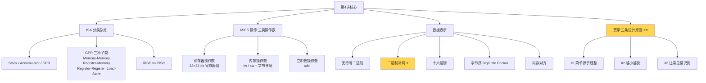
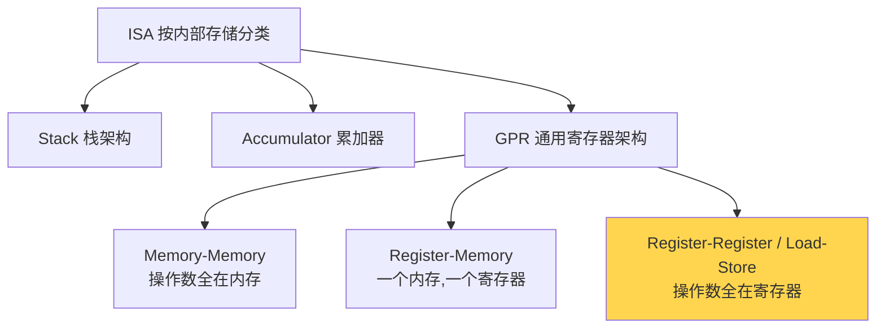
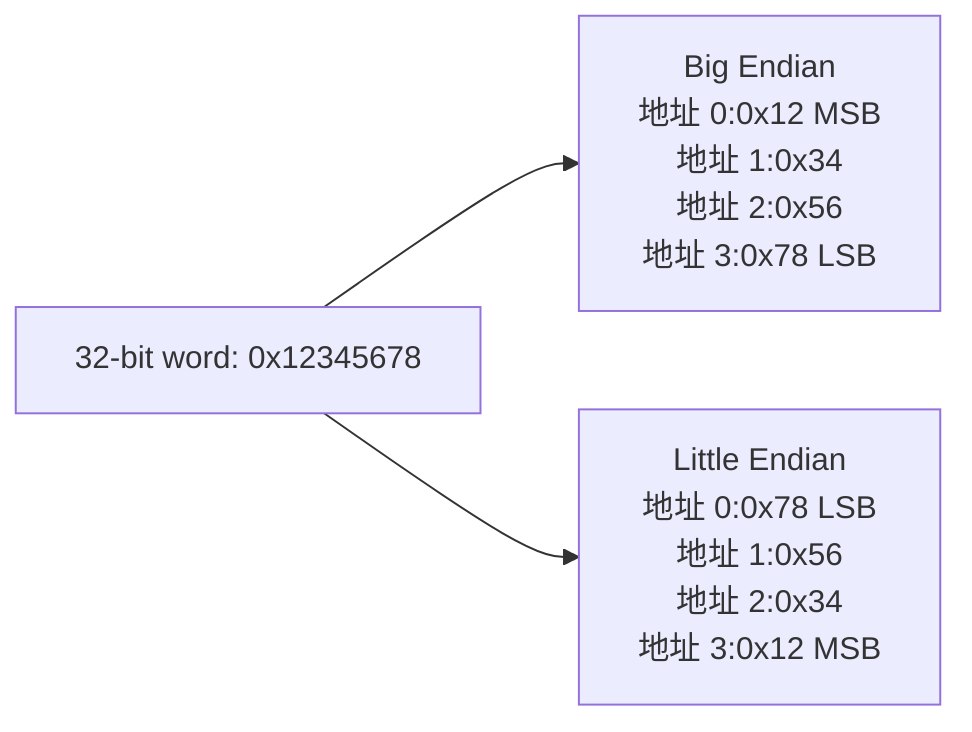
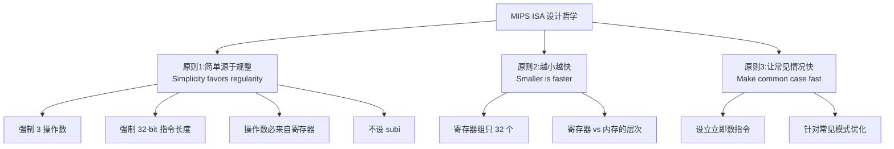

---
title: MIPS指令集架构入门
description: 学习MIPS指令集的基础知识，包括ISA分类、操作数类型、字节寻址、二进制补码以及计算机设计的三大原则。
published: 2026-05-08
category: 计组
tags:
    - 计组
    - MIPS
    - 指令集
---

# 第 4 讲 · MIPS 指令集架构入门 · 复习笔记

> **一句话总览**：进入第 2 章，开始学一门"真实的计算机语言"——MIPS。本讲铺设基础：先看 ISA 分类（看 MIPS 在大家族里的位置），再学 MIPS 三类操作数（**寄存器、内存、立即数**），最后落到 MIPS 处理的**数据本身**（无符号 / 二进制补码 / 十六进制）。贯穿三条设计原则。

## 知识地图



⭐ = 高频考点

---

## 1. ISA 分类:按内部存储类型 ⭐

### 为什么要分类

不同 ISA 的**最根本差异**在于:**ALU 操作的操作数从哪里来、结果放哪里**——也就是处理器内部用什么作为"工作台"。这决定了指令长什么样、要多少条、跑多快。

### 三大类(看处理器内部存储)



### 用 `a = b + (c × d)` 比较各架构

|架构|实现代码|特征|
|---|---|---|
|**Stack**|`push b; push c; push d; mul; add; pop a`|操作数全隐式（栈顶）|
|**Accumulator**|`load c; mul d; add b; store a`|1 个显式 + 1 个隐式累加器|
|**Memory-Memory**|`mul e,c,d; add a,e,b`|2–3 操作数全在内存|
|**Register-Memory**|`load r1,c; mul r1,r1,d; add r1,r1,b; store r1,a`|2 操作数,其一来自内存|
|**Register-Register**|`load r1,c; load r2,d; load r3,b; mul r4,r1,r2; add r5,r4,r3; store r5,a`|3 操作数全在寄存器|

### 各架构的优缺点

|架构|优点|缺点|例子|
|---|---|---|---|
|**Stack**|指令短;编译器简单|指令多;栈访问慢;频繁拷贝/交换|B5000、JVM|
|**Accumulator**|指令短;设计简单|代码低效（多次传输）;难做流水线|EDSAC、IAS（早期）|
|**Memory-Memory**|指令数少（最紧凑）;不需要寄存器|指令长度差异大→**CPI 差异大**;访存流量高|VAX|
|**Register-Memory**|指令数较少;编码紧凑|操作数不对称（结果会破坏一个源）;指令不对称→不同 CPI|IBM 360、**80x86**、68000|
|**Register-Register（Load-Store）**|简单对称→流水线友好;编译器优化空间大|指令多;编码长;代码密度低|CDC6600、CRAY-1、Alpha、**MIPS**、SPARC、PowerPC|

### GPR 架构的优势

为什么现代主流是 GPR(尤其 Load-Store):

- **访问临时值更快**(寄存器 vs 内存)
- **更聪明的编译**(寄存器分配优化空间大)
- **更少的内存流量**

### RISC 赢了吗?

**RISC = Reduced Instruction Set Computer**, 典型代表是 Load-Store 架构(MIPS、ARM、SPARC)。

- **RISC 在三大领域都成功**:桌面、服务器、嵌入式
- **但商业最成功的是 Intel 80x86, 它不是 RISC**, 因为:
    - **二进制兼容**的商业价值巨大
    - 摩尔定律给的晶体管数量"养得起"复杂架构
    - PC 行业出货量大, 能摊薄复杂设计的研发成本
    - 内部 trick:Intel 后来在硬件里把 80x86 指令翻译成**类 RISC 微操作**再执行

> **结论**:技术上 RISC 优雅,但商业上"先到的"+ "兼容性"+ "市场规模" 比技术优雅更重要。

---

## 2. MIPS 算术指令 ⭐

### 基本格式

```
op  destination, source1, source2     # 注释从 # 开始

add $t0, $s1, $s2     # $t0 ← $s1 + $s2
sub $t0, $s1, $s2     # $t0 ← $s1 - $s2
```

### 4 条强制规则(必记)

1. **每条指令只做一个操作**——简单原子
2. **每条指令恰好 32 位**——固定长度
3. **每条指令恰好 3 个操作数**——目的在前,源在后
4. **操作数必须来自寄存器组**(以 `$` 标识)

### 设计原则 1:简单源于规整 ⭐

> **Design Principle 1: Simplicity favors regularity.**
> 
> 规整使硬件实现更简单;简单使**性能更高、成本和功耗更低**。

这是 MIPS 整套指令集设计的根基——所以才有"必须 3 个操作数、必须 32 位"这种"看似死板"的规定。规整带来的好处:

- 译码器简单(总是固定位置取操作数)
- 流水线友好(每条指令时长可预期)
- 编译器易实现(规则统一)

### 例子:把 C 编译成 MIPS

C 源码:

```c
f = (g + h) - (i + j);
```

假设 `f→$s0, g→$s1, h→$s2, i→$s3, j→$s4`, 用 `$t0, $t1` 作临时:

```
add $t0, $s1, $s2     # $t0 = g + h
add $t1, $s3, $s4     # $t1 = i + j
sub $s0, $t0, $t1     # f = $t0 - $t1
```

或更省一个寄存器的版本:

```
add $t0, $s1, $s2     # $t0 = g + h
sub $t0, $t0, $s3     # $t0 = (g+h) - i
sub $s0, $t0, $s4     # f = (g+h-i) - j
```

> **关键观察**:复杂表达式必须**手动拆分**成多条三操作数指令,中间值放临时寄存器。这是**编译器的工作**:将程序变量映射到寄存器。

---

## 3. 寄存器操作数 ⭐

### MIPS 寄存器组

- **32 个寄存器**, 每个 **32 位宽**
- **32 位 = 1 个 word(字)**
- **编号 0–31**, 汇编用 `$名字` 引用

### 设计原则 2:越小越快 ⭐

> **Design Principle 2: Smaller is faster.**

寄存器组只有 32 个 → 访问极快(几乎和 ALU 同速); 主存上百万个位置 → 慢得多。**容量与速度之间是天然 trade-off**。

> 这条原则也呼应了 lec1 的 Eight Great Ideas 第 7 条 "Hierarchy of memories"。

### MIPS 寄存器约定(部分,可能考)

| 名字        | 编号    | 用途             | 调用保存?   |
| --------- | ----- | -------------- | ------- |
| `$zero`   | 0     | **常量 0**(硬件强制) | n.a.    |
| `$at`     | 1     | 汇编器保留          | n.a.    |
| `$v0–$v1` | 2–3   | 函数返回值          | no      |
| `$a0–$a3` | 4–7   | 函数参数           | yes     |
| `$t0–$t7` | 8–15  | 临时值            | **no**  |
| `$s0–$s7` | 16–23 | 保存的变量          | **yes** |
| `$t8–$t9` | 24–25 | 临时值            | no      |
| `$gp`     | 28    | 全局指针           | yes     |
| `$sp`     | 29    | 栈指针            | yes     |
| `$fp`     | 30    | 帧指针            | yes     |
| `$ra`     | 31    | 返回地址(硬件用)      | yes     |

**记忆要点**:

- `$zero` 永远是 0,硬件级别强制——这是为什么 MIPS 没有"赋常量 0 给寄存器"的指令
- **`$t` 系列**:**临时**用,函数调用前不保证保留——调用者要存它
- **`$s` 系列**:**保存**用,函数内若使用必须先存恢复——被调用者要保护

### 寄存器 vs 内存

|维度|寄存器|主存|
|---|---|---|
|数量|32 个|数百万|
|访问速度|快(单周期)|慢(几十–几百周期)|
|直接 ALU 操作|可以|**不可以**,必须先 load|
|编译器目标|尽量把变量放这里|寄存器装不下时溢出到这里|

> **编译器的关键工作:寄存器分配优化**——尽量把高频变量留在寄存器里,低频的才"溢出"到内存。

---

## 4. 内存操作数 ⭐

### 为什么需要内存

寄存器只有 32 个, 但程序里:

- 数组、结构体、动态数据可能很大
- 全局变量数量超出寄存器容量

必须用**主存**作为大容量存储,通过 **load / store** 在寄存器和内存间搬数据。

### lw / sw 指令格式

```
lw $rt, offset($rs)     # $rt ← Mem[$rs + offset]    (load word)
sw $rt, offset($rs)     # Mem[$rs + offset] ← $rt    (store word)
```

- **`$rs`**:基址寄存器(base register), 通常存数组首地址
- **offset**:立即数偏移量, 常量
- **有效地址 = `$rs` + offset**

### 字节寻址(Byte Addressing) ⭐

每个内存地址对应**一个字节(8 位)**, 不是一个字。

```
地址:  0   1   2   3   4   5   6   7   8 ...
内存: [B0][B1][B2][B3][B4][B5][B6][B7][B8]...
       └────word 0────┘└────word 1────┘
```

**关键推论**:

- 一个 word 占 4 字节
- 相邻两个 word 的地址**差 4**(不是 1)
- `A[0]` 在地址 0, `A[1]` 在地址 4, `A[2]` 在地址 8, ..., **`A[i]` 在地址 4i**

### 字对齐(Alignment)

> **要求:对象所在地址必须是其大小的整数倍。** Word(4 字节)的地址必须是 **4 的倍数**。

```
地址  0   1   2   3   4   5   6   7
     [════ word ════]              ← 对齐 ✓
         [════ word ════]          ← 不对齐 ✗
             [════ word ════]      ← 不对齐 ✗
                 [════ word ════]  ← 对齐 ✓ (地址 4)
```

为什么对齐:**硬件每次按 word 边界取数, 对齐能一次完成访问**;不对齐要拆成多次,慢且复杂。

### 内存操作例子

#### 例 1:`g = h + A[8]`

设 `g→$s1, h→$s2, A 的基址→$s3`:

```
lw  $t0, 32($s3)     # $t0 = A[8],  index 8 × 4 bytes = offset 32
add $s1, $s2, $t0    # g = h + A[8]
```

> **关键计算**:`A[8]` 不是 offset 8, 是 offset **8×4 = 32**! 因为字节寻址。

#### 例 2:`A[12] = h + A[8]`

设 `h→$s2, A 的基址→$s3`:

```
lw  $t0, 32($s3)     # $t0 = A[8]
add $t0, $s2, $t0    # $t0 = h + A[8]
sw  $t0, 48($s3)     # A[12] = $t0   (12 × 4 = 48)
```

> 套路:**先 load → 再算 → 最后 store**。

---

## 5. 字节序:Big Endian vs Little Endian ⭐

### 是什么

一个 word 由 4 字节组成。问题:**哪个字节放低地址?**



### 两种约定

|字节序|规则|代表|
|---|---|---|
|**Big Endian**|**MSB**(最高位字节)放在最低地址|**MIPS**、IBM 360/370、Motorola 68k、SPARC、HP PA|
|**Little Endian**|**LSB**(最低位字节)放在最低地址|**Intel 80x86**、DEC VAX、DEC Alpha(Win NT)|

### 助记法

- **Big Endian**:**B**ig end first(大端在前) → MSB 在低地址
- **Little Endian**:**L**ittle end first(小端在前) → LSB 在低地址

> **MIPS 是 Big Endian**——这是本课的考点。

### 为什么这件事重要

如果一个 Big Endian 系统传一个 32 位整数给 Little Endian 系统(如网络通信),不做转换就会**字节顺序倒过来**,数值完全错。这是网络协议字节序(Network Byte Order = Big Endian)的来源。

---

## 6. 立即数操作数 ⭐

### 是什么

直接编码在指令里的常数。MIPS 用 `addi`:

```
addi $s3, $s3, 4      # $s3 ← $s3 + 4
addi $s2, $s1, -1     # $s2 ← $s1 - 1   (用负立即数实现减)
```

### 为什么没有 subi

**MIPS 不提供** `subi` 指令——直接用 `addi` 加负立即数即可。**减少指令种类、保持规整**(再次呼应原则 1)。

### 设计原则 3:让常见情况快 ⭐

> **Design Principle 3: Make the common case fast.**

为什么有立即数指令:

- **小常数极常见**(循环计数 +1、数组偏移、初始化为 0/1)
- 没有立即数的话,每用一次小常数都要先 `lw` 从内存加载,极慢
- 把常数嵌进指令 → 一条指令解决,**避免 load**

> 这也是 lec3 的核心设计哲学——所有 MIPS 设计决策都能映射回三条原则之一。

---

## 7. 三条设计原则总结 ⭐⭐



> **考试套路**:看到一个 MIPS 设计决策, 能用某条原则解释。

---

## 8. 无符号二进制整数

### 公式

n 位无符号数,值为: $$x = x_{n-1} \cdot 2^{n-1} + x_{n-2} \cdot 2^{n-2} + \cdots + x_1 \cdot 2^1 + x_0 \cdot 2^0$$

- **范围**:0 到 2ⁿ – 1
- **32 位无符号**:0 到 4,294,967,295(约 4.3×10⁹)

### 例

```
0000 0000 0000 0000 0000 0000 0000 1011₂
= 1·2³ + 0·2² + 1·2¹ + 1·2⁰
= 8 + 0 + 2 + 1
= 11
```

---

## 9. 二进制补码(Two's Complement)⭐⭐

### 三种有符号编码先做对比

|编码|正数|负数|
|---|---|---|
|**原码 Sign-Magnitude**|最高位是符号位(0 正 1 负), 其余位是数值|同|
|**反码 One's Complement**|同原码|正数按位取反|
|**补码 Two's Complement**|同原码|反码 + 1|

### 例:负数 11011₂(5 位)

|编码|表示|
|---|---|
|原码(假设负)|11011|
|反码|10100|
|补码|10101|

### MIPS 用补码 — 为什么

- **原码、反码都有"两个 0"**(+0 和 -0), 浪费一个编码、运算电路复杂
- 补码**只有一个 0**, 且**减法可以用加法实现**(这是关键!)
- 加减法电路完全统一, 简化硬件

### 补码的核心公式 ⭐

n 位补码的值:

$$x = -x_{n-1} \cdot 2^{n-1} + x_{n-2} \cdot 2^{n-2} + \cdots + x_1 \cdot 2^1 + x_0 \cdot 2^0$$

注意**最高位的权是负的**——这是补码与无符号唯一的差别。

- **范围**:-2ⁿ⁻¹ 到 2ⁿ⁻¹ - 1
- **32 位补码**:-2,147,483,648 到 2,147,483,647

### 例

```
0111 1111 ... 1111₂  = 0·2³¹ + 1·2³⁰ + ... + 1·2⁰ = 2³¹ - 1 = 2,147,483,647
1000 0000 ... 0000₂  = -1·2³¹ + 0 + ... + 0 = -2,147,483,648
1111 1111 ... 1111₂  = -1
0000 0000 ... 0000₂  = 0
```

### 补码的关键特性

1. **bit 31 是符号位**:1 = 负, 0 = 非负
2. **-(-2ⁿ⁻¹) 无法表示**——因为正数最大只到 2ⁿ⁻¹ - 1, 这是补码的一个不对称
3. **非负数的无符号和补码表示相同**(只有负数不同)
4. **几个特殊值**:
    - 0:`0000...0000`
    - -1:`1111...1111`(全 1)
    - 最大正:`0111...1111`
    - 最小负:`1000...0000`

### 取反(Negate)规则 ⭐

> **取反 = 按位取反 + 1**

证明思路:`x + (按位取反 x) = 全 1 = -1`, 所以 `按位取反 x = -1 - x`, 加 1 得 `-x`。

**例:把 +2 变成 -2(8 位)**

```
+2  =  0000 0010
按位取反 =  1111 1101
+1  =  1111 1110     ← -2 ✓
```

### 补码运算实例(减法 → 加法)

> **核心思想**:`a - b = a + (-b)`, 把减法变成加补码的加法。

补码运算结果**仍是补码**(若结果是负数,需转回原码看值)。

#### 例:十进制类比

假设"模 10 系统"(单个十进制位):

- -4 的"补"是 6(10 - 4)
- -8 的"补"是 2(10 - 8)
- `8 - 4 = 8 + 6 = 14`(忽略进位 1) → 4 ✓
- `4 - 8 = 4 + 2 = 6` → 这是负数对应的补码 → 转回 → -4 ✓

#### 例:5 位二进制

- `8 - 4`:01000 + 11100 = 1**00100**(忽略首位进位) → 4 ✓
- `4 - 8`:00100 + 11000 = 11100 → 是负数补码 → 还原 → -4 ✓

### 易错警告

> 运算时**所有数必须用相同位数表示**为补码再做。位数不够会溢出。

---

## 10. 十六进制(Hexadecimal)

### 是什么

**逢 16 进 1**, 即 base 16。0–9 同十进制, A–F = 10–15。

### 为什么用十六进制

- **每 4 位二进制 = 1 位十六进制**(因为 16 = 2⁴)
- **二进制冗长**(32 位写出来 32 个字符), 十六进制紧凑(8 个字符)
- **比十进制更直观地反映位模式**

### 转换表(必背)

|Hex|Bin|Hex|Bin|Hex|Bin|Hex|Bin|
|---|---|---|---|---|---|---|---|
|0|0000|4|0100|8|1000|C|1100|
|1|0001|5|0101|9|1001|D|1101|
|2|0010|6|0110|A|1010|E|1110|
|3|0011|7|0111|B|1011|F|1111|

### 例:`0xECA8 6420`

```
E    C    A    8    6    4    2    0
1110 1100 1010 1000 0110 0100 0010 0000
```

> **方法**:每个十六进制位独立换成 4 位二进制即可。

---

## 期中重点速记 ⭐

按概率排序:

1. **三条设计原则**——能背名字 + 一句解释 + 给出具体例子
2. **MIPS 算术指令格式**——`op dest, src1, src2`, 32 位、3 操作数、寄存器
3. **寄存器组规模**——32 个 × 32 位, 一个 word = 32 位 = 4 字节
4. **lw/sw 格式**——`lw $rt, offset($rs)`, 有效地址 = $rs + offset
5. **字节寻址 + 数组偏移**——`A[i]` 在 offset 4i, 必考
6. **MIPS 是 Big Endian** + Big/Little 的区别
7. **字对齐**——word 地址必须是 4 的倍数
8. **补码取反规则**——按位取反 + 1
9. **补码值公式**——`x = -bit_n-1·2^(n-1) + ...`
10. **二进制 ↔ 十六进制**——4 位一组互转
11. **GPR vs Stack vs Accumulator**——MIPS 属于 Load-Store(GPR 中的一种)
12. **常用寄存器约定**——$zero、$t/$s 系列、$ra 等

---

## 易错点汇总

- ❌ `A[i]` 用 offset 等于 i → ✅ offset = **4i**(字节寻址)
- ❌ 写 `subi`(MIPS 没有) → ✅ 用 `addi $s, $s, -k`
- ❌ 把 MIPS 当成 Little Endian → ✅ MIPS 是 **Big Endian**
- ❌ 写出 `add a, b+c, d`(操作数嵌表达式) → ✅ MIPS 一条指令只一次操作,需拆开
- ❌ 把变量直接写成 MIPS 操作数(如 `add a, b, c`) → ✅ 必须用 `$寄存器`
- ❌ 补码取反只按位取反,忘记 +1 → ✅ **按位取反 + 1**
- ❌ 补码运算时位数不一致 → ✅ 必须扩展到相同位数
- ❌ 把"补码的 1000...0"理解成 +0 或异常值 → ✅ 是**最小负数 -2ⁿ⁻¹**, 没有对应的相反数
- ❌ Stack 架构指令短就觉得它快 → ✅ 短指令 ≠ 快, Stack 操作多、栈访问慢, 总体慢
- ❌ "RISC 赢了"的绝对结论 → ✅ 技术上 RISC 优雅, 但商业上 80x86(非 RISC)最成功

---

## 自测题

### 一、选择题

**1. 关于 MIPS 算术指令,下列说法错误的是:**

A. 每条指令固定 32 位 B. 每条指令做且仅做一个算术操作 C. 操作数顺序是"目的在前,源在后" D. 算术指令的操作数可以是寄存器,也可以是内存地址

<details> <summary>答案与解析</summary>

**答案:D**

- A、B、C 都对——这是 MIPS 算术指令的核心规则,体现"简单源于规整"原则。
- D 错:**MIPS 是 Load-Store 架构**,算术指令的操作数**必须全在寄存器**,不能直接操作内存。要操作内存数据,必须先 `lw` 加载到寄存器,运算后再用 `sw` 写回。这正是它和 80x86(Register-Memory)的关键区别。

</details>

**2. 在 MIPS 中,要实现 `A[10] = A[5] + 1`(A 的基址在 $s0),下列代码哪段正确?**

A.

```
lw  $t0, 5($s0)
addi $t0, $t0, 1
sw  $t0, 10($s0)
```

B.

```
lw  $t0, 20($s0)
addi $t0, $t0, 1
sw  $t0, 40($s0)
```

C.

```
lw  $t0, 5($s0)
add  $t0, $t0, 1
sw  $t0, 10($s0)
```

D.

```
load $t0, A[5]
add  $t0, $t0, 1
store $t0, A[10]
```

<details> <summary>答案与解析</summary>

**答案:B**

- A 错:用了元素 offset 而非字节 offset——`A[5]` 在地址 5×4=**20**,不是 5;`A[10]` 在 10×4=**40**。
- B 对:offset 计算正确,使用 `addi`(立即数加),指令名也正确。
- C 错:`add $t0, $t0, 1` 不合法——`add` 操作数必须是寄存器,要用立即数版本的 `addi`。
- D 错:语法不是 MIPS。`load/store` 不是 MIPS 指令名(应该是 `lw/sw`),也不能直接写 `A[5]`。

**关键提醒**:字节寻址下数组下标 i 对应 offset = **4i**,这是必考点。

</details>

**3. 关于二进制补码,下列说法错误的是:**

A. n 位补码的范围是 -2ⁿ⁻¹ 到 2ⁿ⁻¹ - 1 B. 0 在补码中的表示唯一 C. -2ⁿ⁻¹ 的相反数 +2ⁿ⁻¹ 也能用 n 位补码表示 D. 补码的取反规则是"按位取反加 1"

<details> <summary>答案与解析</summary>

**答案:C**

- A 对:补码范围确实是 [-2ⁿ⁻¹, 2ⁿ⁻¹-1],负数比正数多一个。
- B 对:补码只有一个 0(全 0),不像原码反码有 +0/-0 两种。
- C 错:**最小负数没有对应的正数**。例如 8 位补码中 -128 = 1000 0000,但 +128 超出 [-128, +127] 范围,**无法用 8 位补码表示**。这是补码的不对称性。
- D 对:是补码取相反数的标准方法。

</details>

**4. MIPS 是 _______ 架构, 字节序是 _______:**

A. Register-Memory; Little Endian B. Load-Store; Big Endian C. Stack; Big Endian D. Memory-Memory; Little Endian

<details> <summary>答案与解析</summary>

**答案:B**

- MIPS 是典型的 **Register-Register / Load-Store**(GPR 子类),所有算术操作只在寄存器进行,内存访问只通过 lw/sw。
- MIPS 是 **Big Endian**(MSB 在最低地址)。同样是 Big Endian 的还有 IBM 360、Motorola 68k、SPARC。
- Little Endian 的代表是 Intel 80x86,Memory-Memory 的代表是 VAX(都不是 MIPS)。

</details>

**5. MIPS 设有 `addi` 但没有 `subi`,这体现了哪条设计原则?**

A. 原则 1:简单源于规整 B. 原则 2:越小越快 C. 原则 3:让常见情况快 D. 原则 1 和原则 3 都体现

<details> <summary>答案与解析</summary>

**答案:D**

- **原则 1 (简单源于规整)**:不设 subi 减少了指令种类,使指令集更规整、硬件实现更简单。负立即数复用 addi 即可,无需另开一类指令。
- **原则 3 (让常见情况快)**:**addi 本身存在**就是为了"小常数频繁使用"这种常见情况——避免每次用常数都要先 lw 加载。

所以两条原则都有体现:**addi 存在**是原则 3,**不另设 subi**是原则 1。**最佳答案是 D**。

</details>

### 二、简答题

**1. 简述 MIPS 指令集的三条设计原则,并各举一个 MIPS 中具体体现该原则的例子。**

<details> <summary>参考答案</summary>

**原则 1:简单源于规整(Simplicity favors regularity)** 规整使硬件简单,简单使性能高、成本低。

- **例子**:所有算术指令都是固定 3 操作数、固定 32 位长度;不设 subi(用负立即数代替)。

**原则 2:越小越快(Smaller is faster)** 存储容量越小,访问速度越快;反映在层次化存储设计中。

- **例子**:MIPS 寄存器组只设 32 个寄存器,而非更多——访问寄存器仅需 1 个周期,主存则需几十周期。

**原则 3:让常见情况快(Make the common case fast)** 优先优化最频繁出现的情况。

- **例子**:设立 `addi` 立即数指令——程序中频繁出现"加一个小常数"的情况(循环计数、数组偏移),把常数嵌入指令避免了一次 load,大幅提速。

</details>

**2. 解释 GPR 架构、Stack 架构、Accumulator 架构的核心区别。MIPS 属于哪一种,为什么这种架构成为现代主流?**

<details> <summary>参考答案</summary>

**核心区别**(看 ALU 操作数从哪来):

|架构|ALU 操作数位置|代码长度|设计复杂度|
|---|---|---|---|
|**Stack**|隐式(全部从栈顶取)|较长(多 push/pop)|编译简单,但栈访问慢|
|**Accumulator**|一个隐式累加器 + 一个内存|较长(多 load/store)|简单但低效,难流水线|
|**GPR(通用寄存器)**|寄存器组中的若干个|短-中(看子类)|最复杂但最灵活|

**MIPS 属于 GPR 中的 Register-Register(Load-Store)子类**——所有 ALU 操作数都在寄存器,内存只能通过 lw/sw 间接访问。

**GPR 成为主流的原因**:

1. **访问临时值最快**(寄存器近 ALU)
2. **编译器优化空间大**(寄存器分配)
3. **内存流量低**(高频变量留在寄存器)
4. **指令对称、简单 → 流水线友好**,对应"原则 1 简单源于规整"
5. RISC 思潮(MIPS、ARM、SPARC、PowerPC 都是这个方向)

</details>

**3. 什么是字对齐(Alignment)? 为什么 MIPS 要求 word 地址是 4 的倍数?**

<details> <summary>参考答案</summary>

**字对齐**:对象在内存中的起始地址必须是其大小的整数倍。MIPS 中,4 字节的 word 地址必须是 4 的倍数(0, 4, 8, 12, ...)。

**为什么要对齐**:

1. **硬件按 word 边界取数**——每次访存读取一个对齐的 word,简单高效。
2. **不对齐会跨越 word 边界**——硬件需要发起两次访存再拼接,代价是 2× 时间和复杂电路。
3. **简化硬件设计**(对应原则 1:简单源于规整)。

**强制对齐的代价**:某些情况下会浪费内存(填充 padding),但换来访问速度,在主流架构里是合算的取舍。

</details>

### 三、计算题

**1. (汇编翻译) 假设 `f→$s0, g→$s1, h→$s2, i→$s3, j→$s4`, 把以下 C 代码翻译成 MIPS 汇编:**

```c
f = (g - h) + (i - j);
```

<details> <summary>解答过程</summary>

```
sub $t0, $s1, $s2     # $t0 = g - h
sub $t1, $s3, $s4     # $t1 = i - j
add $s0, $t0, $t1     # f = $t0 + $t1
```

**关键点**:

- 复杂表达式必须用临时寄存器拆解,每条指令只一个运算
- 操作数顺序"目的在前"
- 临时寄存器用 `$t` 系列

</details>

**2. (内存操作) 已知数组 `int A[]` 的基地址在 `$s0`,`x` 在 `$s1`。把以下代码翻译成 MIPS:**

```c
A[5] = A[3] + x;
```

<details> <summary>解答过程</summary>

**步骤分析**:

- A[3] 的字节 offset = 3 × 4 = **12**
- A[5] 的字节 offset = 5 × 4 = **20**

**MIPS 代码**:

```
lw  $t0, 12($s0)      # $t0 = A[3]
add $t0, $t0, $s1     # $t0 = A[3] + x
sw  $t0, 20($s0)      # A[5] = $t0
```

**易错点**:不要把数组下标直接当 offset!必须乘 4 转为字节地址。

</details>

**3. (补码运算) 用 8 位二进制补码计算 `25 - 18`,写出每一步:**

<details> <summary>解答过程</summary>

**思路**:`25 - 18 = 25 + (-18)`,先把 -18 转成补码再相加。

**第一步:写出 25 和 -18 的 8 位补码**

```
25  = 0001 1001
18  = 0001 0010
```

求 -18 的补码(按位取反 + 1):

```
按位取反 18: 1110 1101
+ 1:         1110 1110
所以 -18 = 1110 1110
```

**第二步:相加**

```
   0001 1001    (25)
 + 1110 1110   (-18)
 ─────────────
 1 0000 0111
```

**第三步:忽略最高位的进位**(8 位运算结果只取低 8 位):

```
结果 = 0000 0111 = 7 ✓
```

**验证**:25 - 18 = 7 ✓

**关键洞察**:补码的减法本质就是加上对方的补码,**进位丢弃**。这就是为什么硬件只需一种加法器,无需单独的减法器。

</details>

**4. (进制转换) 把十六进制 `0xCAFE BABE` 转换成 32 位二进制。**

<details> <summary>解答过程</summary>

**方法**:每个十六进制位独立查表换成 4 位二进制。

|Hex|C|A|F|E|B|A|B|E|
|---|---|---|---|---|---|---|---|---|
|Bin|1100|1010|1111|1110|1011|1010|1011|1110|

**结果**:

```
0xCAFE BABE = 1100 1010 1111 1110 1011 1010 1011 1110
```

按 word 形式:`1100 1010 1111 1110 1011 1010 1011 1110`(共 32 位 ✓)

**作为补码解读这个值**:最高位是 1,负数。 作为无符号解读:0xCAFEBABE ≈ 3.4 × 10⁹

</details>

**5. (Endianness) 32 位整数 `0x12345678` 存储在地址 0x1000 起的 word。分别写出 Big Endian 和 Little Endian 系统中地址 0x1000–0x1003 各字节的值。**

<details> <summary>解答过程</summary>

数值 `0x12345678` 由 4 个字节组成:**0x12**(MSB)、0x34、0x56、**0x78**(LSB)。

**Big Endian(MIPS)**:MSB 放最低地址。

|地址|内容|
|---|---|
|0x1000|**0x12** (MSB)|
|0x1001|0x34|
|0x1002|0x56|
|0x1003|**0x78** (LSB)|

**Little Endian(80x86)**:LSB 放最低地址。

|地址|内容|
|---|---|
|0x1000|**0x78** (LSB)|
|0x1001|0x56|
|0x1002|0x34|
|0x1003|**0x12** (MSB)|

**记忆要点**:

- "Big" = MSB 在前(low address) → 高位先存
- "Little" = LSB 在前(low address) → 低位先存
- MIPS 是 **Big**, x86 是 **Little**

</details>