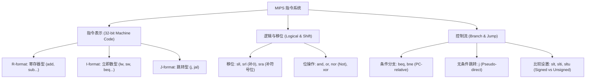

# MIPS 指令表示与分支逻辑 · 深度复习笔记

> 一句话总览：本节详细剖析了 MIPS 指令的三种核心格式（R/I/J）及其编码原理，重点讲解了移位/逻辑运算、分支决策的硬件设计权衡，以及 PC 相对寻址与伪直接寻址的精确计算。

## 知识地图



---

## 1. 指令表示：三大核心格式对比

MIPS 遵循 **Design Principle 4: Good design demands good compromises**（好设计源于折中）。为了在保持 32 位定长的同时支持不同操作，设计了三种格式，并尽可能让字段对齐。

| 格式 | [31:26] op | [25:21] rs | [20:16] rt | [15:11] rd | [10:6] shamt | [5:0] funct | 用途 |
| :--- | :--- | :--- | :--- | :--- | :--- | :--- | :--- |
| **R-type** | 0 | 源1 | 源2 | 目的 | 移位量 | 功能码 | 算术/逻辑运算 |
| **I-type** | opcode | 源 | 目的/源 | [15:0] 16-bit 立即数 / 地址偏移 | - | - | 存取、分支、立即数运算 |
| **J-type** | opcode | [25:0] 26-bit 目标地址 (Target Address) | - | - | - | - | 无条件跳转 |

---

## 2. 逻辑与移位操作 (Logical & Shift)

### 移位操作深度辨析
*   **sll (Shift Left Logical)**：左移并在右侧补 0。$i$ 位左移相当于乘以 $2^i$。
*   **srl (Shift Right Logical)**：右移并在左侧补 0。适用于**无符号数**。
*   **sra (Shift Right Arithmetic)**：右移并在左侧**补符号位**。确保有符号数移位后结果除以 2 的算术正确性。
*   **硬件实现**：移位操作由独立的 **Barrel Shifter**（桶形移位器）实现，不占用 ALU。

### 位运算应用
*   **and/andi**：掩码操作（Masking），用于将特定位清零，保留其余位。
*   **or/ori**：包含操作（Including），用于将特定位置 1。
*   **nor**：取反操作。MIPS 没有 `not` 指令，使用 `a NOR $zero` 等效于 `NOT a`。

---

## 3. 分支与寻址计算 (Branch & Jump Addressing)

### 条件分支 (Conditionals)
*   **beq/bne**：基于相等/不相等。
*   **slt/slti (Set on Less Than)**：
    *   **Signed (slt/slti)**：`-1 (0xFF...F)` 比 `1 (0x0...1)` 小。
    *   **Unsigned (sltu/sltui)**：`-1` 被视为 $2^{32}-1$，比 `1` 大。
*   **设计权衡**：硬件实现 = 的速度远快于 `<`。因此 MIPS 使用 `slt` + `beq/bne` 组合而非复杂的单条 `blt` 指令，从而维持较快的时钟频率。

### 地址计算细节（高频考点）

#### 1. PC-相对寻址 (I-format Branches)
用于 `beq`, `bne`。
*   **字段含义**：16 位 `address` 是**字偏移量**（Word Offset）。
*   **计算公式**：$\text{Target PC} = (\text{PC} + 4) + (\text{Offset} \times 4)$
*   **范围**：可跳转至当前指令前后约 $\pm 2^{15}$ 字（即 $\pm 128$ KB）。
*   **特殊处理**：若目标过远，汇编器会自动重写。例如 `beq $s0, $s1, L1` 变为：
    ```mips
    bne $s0, $s1, L2
    j L1
    L2: ...
    ```

#### 2. 伪直接寻址 (J-format Jumps)
用于 `j`, `jal`。
*   **字段含义**：26 位 `address` 是指令在内存中的**序号**（Word Address）。
*   **计算步骤**：
    1.  取 26 位 `address`。
    2.  左移 2 位（变回字节地址，补 `00`）。
    3.  拼接当前 `PC+4` 的**高 4 位**作为最左侧 4 位。
*   **公式**：$\text{Target PC} = (\text{PC} + 4)_{[31:28]} \parallel (\text{Address} \ll 2)$

## 32位整数的存储

将一个 32 位常量加载到寄存器中的标准做法。我们将 32 位拆成**高 16 位**和**低 16 位**。

- **第一步：`lui` (Load Upper Immediate)**
    将 16 位立即数存入寄存器的**高 16 位**，并将低 16 位清零。
    - 例如：`lui $t0, 0x1234` $\rightarrow$ `$t0` 变为 `0x12340000`
- **第二步：`ori` (Or Immediate)**
    将剩下的 16 位立即数与寄存器进行“或”运算，填充到**低 16 位**。
    - 例如：`ori $t0, $t0, 0x5678` $\rightarrow$ `$t0` 最终变为 `0x12345678`
---

## 自测题 (深化版)

### 一、选择题

**1. 给定 $s0$ 存储补码 `0xFFFFFFFF`，执行 `slti $t0, $s0, 1` 和 `sltui $t0, $s0, 1` 后，$t0$ 的值分别是？**

A. 1, 0    B. 0, 1    C. 1, 1    D. 0, 0

<details>
<summary>答案与解析</summary>

**答案：A**

解析：`slti` 是有符号比较，-1 < 1，结果为 1。`sltui` 是无符号比较，0xFFFFFFFF 是极其大的正数，远大于 1，结果为 0。

</details>

**2. MIPS 跳转指令 `j` 字段中只存储了 26 位地址，它是如何跳转到 32 位地址空间的？**

A. 使用寄存器寻址
B. 将 26 位地址符号位扩展到 32 位
C. 左移 2 位并拼接 PC+4 的高 4 位
D. 直接作为绝对地址

<details>
<summary>答案与解析</summary>

**答案：C**

解析：这是伪直接寻址的定义。左移 2 位是因为指令字对齐（末尾必为 00），通过拼接 PC 高 4 位可以访问同 256MB 区域内的任何位置。

</details>

### 二、计算题

**1. 若一条 `beq $s0, $s1, Offset` 指令位于地址 `0x00008000`，其 `Offset` 字段为 `0x0005`。请计算跳转成功时的目标地址。**

<details>
<summary>解答过程</summary>

1.  **确定 PC+4**：`0x00008000 + 4 = 0x00008004`。
2.  **计算字节偏移**：`Offset (0x5) * 4 = 0x14`。
3.  **求和**：`0x00008004 + 0x00000014 = 0x00008018`。
**最终地址：0x00008018**。

</details>
