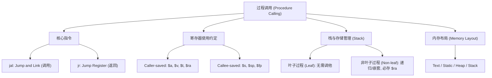

# MIPS 过程调用与内存管理 · 复习笔记

> 一句话总览：本节聚焦于 MIPS 如何支持函数调用，包括 `jal/jr` 指令、寄存器使用约定（Caller vs Callee）、栈帧结构的维护以及程序五大内存区域的划分。

## 知识地图

---

## 1. 过程调用的核心步骤

一个标准的过程调用包含以下 6 个硬件/软件协同步骤：
1.  **传参**：将参数放入被调用者（Callee）可见的地方（`$a0-$a3`）。
2.  **控制转移**：跳转到过程起始地址（`jal`）。
3.  **分配资源**：为过程分配所需的存储空间（栈空间/寄存器）。
4.  **执行任务**：执行过程体操作。
5.  **返回结果**：将结果放入调用者（Caller）可见的地方（`$v0-$v1`）。
6.  **跳转回原位**：返回到调用点的下一条指令（`jr $ra`）。

---

## 2. 核心指令：jal 与 jr

### jal (Jump and Link)
*   **动作**：
    1.  将下一条指令地址（PC+4）保存到 **`$ra`** (return address)。
    2.  跳转到目标 Label 地址。
*   **考点**：`$ra` 是在硬件层面被自动覆盖的。在非叶子过程中，必须通过软件方式手动将 `$ra` 压栈。

### jr (Jump Register)
*   **动作**：将指定寄存器（通常是 `$ra`）中的值复制到 PC，实现程序跳转。
*   **用途**：函数返回、`switch/case` 快速跳转、函数指针调用。

---

## 3. 寄存器使用约定 (Register Usage)

| 寄存器           | 名称             | 编号          | 保存责任       | 说明                                  |
| :------------ | :------------- | :---------- | :--------- | :---------------------------------- |
| **`$a0-$a3`** | Arguments      | 4-7         | **Caller** | 传参用。Caller 若后续还要用，需自行备份。            |
| **`$v0-$v1`** | Values         | 2-3         | -          | 用于存放返回值。                            |
| **`$t0-$t9`** | Temporaries    | 8-15, 24-25 | **Caller** | 临时寄存器。Callee 可随意覆盖。                 |
| **`$s0-$s7`** | Saved          | 16-23       | **Callee** | **必须保证调用前后不变**。若 Callee 要用，需先压栈再恢复。 |
| **`$sp`**     | Stack Pointer  | 29          | Callee     | 始终指向栈顶。                             |
| **`$ra`**     | Return Addr    | 31          | Caller     | 存放返回地址。                             |
| **`$gp`**     | Global Pointer | 28          | -          | 指向静态数据区。                            |
| **`$fp`**     | Frame Pointer  | 30          | Callee     | 指向当前栈帧起始（并非所有编译器都必须使用）。             |

---

## 4. 栈与存储管理 (Stack Management)

### 栈 (Stack) 的操作原则
*   **方向**：从高地址向**低地址**增长。
*   **开辟空间**：`addi $sp, $sp, -n` (n 必须是 4 的倍数)。
*   **释放空间**：`addi $sp, $sp, n`。
*   **栈帧 (Stack Frame)**：也称活动记录（Activation Record），包含保存的寄存器数值和局部变量。

### 叶子过程 vs. 非叶子过程
1.  **叶子过程 (Leaf Procedure)**：
    *   特征：不调用其他任何过程。
    *   优化：可以不使用栈（如果寄存器够用），也不必保存 `$ra`。
2.  **非叶子过程 (Non-leaf)**：
    *   特征：会进行嵌套调用或递归。
    *   **必修课**：必须在栈中保存自己的 `$ra`。

---

## 5. 内存布局 (Memory Layout)

MIPS 程序内存空间划分：

| 区域 | 地址走向 | 内容 | 管理方式 |
| :--- | :--- | :--- | :--- |
| **Stack** | 向下 (↓) | 局部变量、保存的寄存器、返回地址 | 自动（编译器/硬件） |
| **Dynamic Data (Heap)** | 向上 (↑) | `malloc` 或 `new` 分配的空间 | 程序员手动 |
| **Static Data** | 固定 | 全局变量、常量字符串、`static` 变量 | `$gp` 偏移访问 |
| **Text** | 固定 | 程序指令 (二进制机器码) | 只读 |
| **Reserved** | 最底端 | 操作系统保留区 | - |

---

## 自测题

### 一、选择题

**1. 关于 MIPS 栈指针 `$sp` 的描述，正确的是？**

A. 栈向上增长，`$sp` 增加时代表入栈
B. 栈向下增长，`$sp` 减小时代表开辟空间
C. 栈向下增长，入栈操作使用 `lw` 指令
D. `$sp` 指向的是静态数据区的起始位置

答案与解析

**答案：B**

解析：MIPS 栈从高地址向低地址增长。减小 `$sp` 的值意味着在内存中下移指针，从而为当前过程开辟新的存储空间。入栈使用 `sw`（Store Word）指令。

**2. 为什么 Callee（被调用者）不需要负责保存 `$t0-$t9` 寄存器？**

A. 它们是只读的
B. 它们的保存责任归属于 Caller（调用者）
C. 它们由操作系统自动保护
D. 它们存储在堆（Heap）中，不会消失

答案与解析

**答案：B**

解析：根据 MIPS 约定，`$t` 寄存器是“临时”的。Caller 如果觉得这些值很重要，在调用 `jal` 前必须自己先把它们存到栈里。Callee 可以假设这些寄存器是可以随意使用的。

### 二、简答题

**1. 在递归函数（如 `fact(n)`）中，如果不把 `$ra` 存入栈会发生什么后果？**

参考答案

会出现**死循环**或**无法正确返回**。
当执行递归调用 `jal fact` 时，硬件会自动将当前的 PC+4 写入 `$ra`。如果上一层函数的返回地址已经在 `$ra` 中，它会被这一层的新地址覆盖。当函数执行完毕准备 `jr $ra` 返回时，它会不断跳转回自己的递归调用点，而不是回到初始的调用者那里。

---

